
<strong>Curso Data Analysis - Módulo 4 PREWORK de Introducción a la visualización de datos: Distribuciones</strong>

<strong>PREWORK SESIÓN 2</strong>

### Introducción

En la sesión pasada aprendimos cómo podemos describir un conjunto de datos utilizando un solo número. Estimados como el promedio, la mediana y la desviación estándar nos dan un vistazo de nuestros datos con un solo valor. Pero vimos al final, cuando aprendimos percentiles, que utilizar varias medidas al mismo tiempo nos puede dar una idea mucho más precisa de cómo están organizados nuestros datos.

Explorar la distribución de los datos nos da una imagen general de la organización de estos y nos ayuda a tener más claridad acerca de dónde están "amontonados" nuestros datos, qué tan esparcidos se encuentran y qué tantos valores atípicos tenemos.

#### Objetivos

- Identificar qué es una distribución y por qué nos interesa conocer la distribución de nuestros datos.
- Utilizar la librería Seaborn.
- Conocer los boxplots y entender cómo se generan.
- Conocer las tablas de frecuencias y los histogramas como maneras de visualizar distribuciones.
- Clasificar algunas de las formas que generan los histogramas.
- Conocer las gráficas de densidad como una alternativa a los histogramas clásicos.

---

### Distribuciones

Si tomamos el valor mínimo y el valor máximo de nuestro conjunto de datos tenemos el rango dentro del cual están contenidos todos nuestros datos. Pero dentro de ese rango los valores pueden estar distribuidos de muchas maneras distintas. A veces están muy cerca del valor mínimo, a veces están muy cerca del valor máximo; a veces se amontonan casi todos alrededor de la mediana y sólo unos pocos toman los valores extremos; a veces generan incluso dos "montículos" alrededor de los cuales se concentran la mayoría de los datos. Hay muchísimas posibilidades.

Usando valores individuales es imposible tener una idea tan general de nuestro conjunto y es por eso que solemos utilizar algunas técnicas que toman en cuenta todo el conjunto de datos al mismo tiempo.

Una de estas técnicas es la visualización de datos. A partir de ahora, la visualización va a formar una parte esencial de nuestro proceso. Vamos a comenzar esta sesión aprendiendo nuestra primera librería de visualización.

### Seaborn

Seaborn es una librería de Python para crear visualizaciones bastante atractivas rápidamente. Seaborn está construida sobre la librería de visualización más conocida de Python: matplotlib. Más adelante aprendemos matplotlib, pero Seaborn es una gran manera de introducirnos al tema de las visualizaciones sin mucho esfuerzo.

Todas las gráficas que verás en esta sesión estarán hechas con Seaborn. Aprenderás a usar Seaborn durante el Work, ¡así que por lo pronto empieza a deleitarte con las posibilidades!

### Boxplots

Vamos a comenzar nuestra exploración de distribuciones con una visualización que está muy ligada al último tema de la sesión pasada: los percentiles. Los boxplots son la representación gráfica de los percentiles y, como ya verás, nos dan mucha más claridad acerca de la distribución de nuestros datos.

Digamos que tenemos un conjunto de datos que contiene edades de personas que acuden al Parque España durante los fines de semana. Nuestro valor mínimo es 2 años y nuestro valor máximo es 95 años. Vamos a dibujar un eje x donde quepa todo nuestro rango de valores:

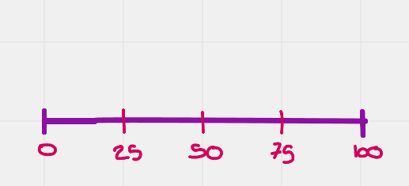

Grafiquemos nuestro valor mínimo y máximo:

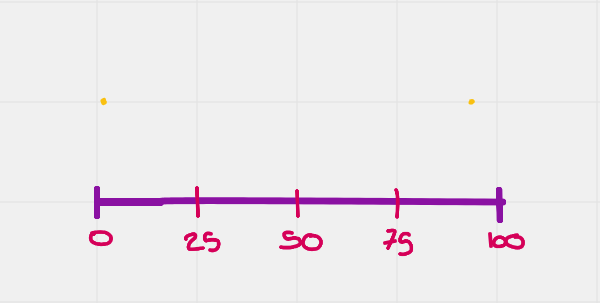

Ahora, tenemos que obtener el percentil 25, la mediana y el percentil 75 y agregarlos a nuestra gráfica como líneas:

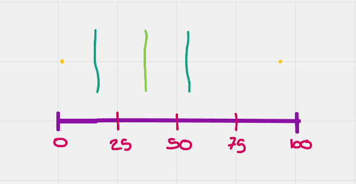

Luego dibujamos una caja alrededor de ellos:

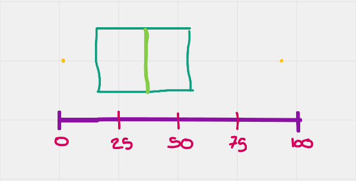

Esta caja representa nuestro rango intercuartílico, que si recuerdas bien, es el rango entre el percentil 75 y el percentil 25. Dentro de esta caja se encuentra el 50% de nuestros datos, los más cercanos a la mediana.

Después toca dibujar los llamados bigotes de nuestra caja. Los bigotes se extienden hacia la derecha y la izquierda de nuestra caja, intentando abarcar todo el resto de los datos que se encuentran desperdigados fuera del rango intercuartílico. La razón por la que usé la palabra "intentando", es porque a veces esos bigotes no alcanzan a cubrir **todos** los datos. Hay muchas maneras de hacer esto, pero usualmente los bigotes tienen una longitud máxima de 1.5 * Rango Intercuartílico (IQR en inglés). Es decir, el bigote inferior puede tener una extensión máxima de `percentil 25 - (1.5 * IQR)` y el bigote superior puede tener una extensión máxima de `percentil 75 + (1.5 * IQR)`. Vamos a agregar nuestros bigotes:

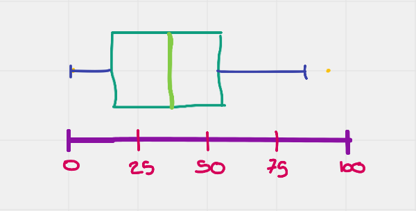

Como puedes ver, el bigote inferior cubrió el primer cuartil (el primer 25% de los datos) por completo. Esto se debe a que los datos están muy concentrados hacia los valores pequeños del rango. En cambio el bigote superior no alcanzó a cubrir todo el último cuartil. Esto se debe a que hay valores muy alejados del IQR.

Si hay más valores fuera de los bigotes además del valor máximo, podemos agregarlos como puntos:

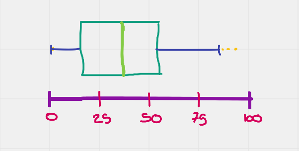

Estos valores individuales son lo que podemos considerar nuestros valores atípicos, ya que son los valores "más distintos" en nuestro conjunto de datos.

Los boxplots son nuestra primera herramienta para visualizar distribuciones de datos y, como puedes ver, nos dan muchísima información con muy pocos elementos.

### Tabla de frecuencias

Los percentiles segmentan nuestros datos en segmentos de distinto tamaño en los que tenemos el mismo número de muestras. Es decir, hay igual cantidad de muestras en el segmento que va del percentil 0 al 25 que en el segmento que va del percentil 25 al 50. También tenemos el mismo número de muestras en el segmento que va del percentil 0 al 50 que en el que va del percentil 50 al 100. 

Lo que varía entre segmentos es el tamaño que tienen. Es decir, en un dataset donde el valor mínimo es 0 y el valor máximo es 100, el primer cuartil (el primer 25% de los datos) podría abarcar desde el valor 0 al 15, mientras que el segundo cuartil (el segundo 25% de los datos) podría abarcar desde el valor 15 al 45.

En cambio, las tablas de frecuencias segmentan nuestros datos en segmentos que miden lo mismo pero que contienen una cantidad distinta de muestras.

Para ejemplificar, vamos a tomar nuestro dataset de propiedades en venta en la ciudad de Melbourne, Australia. Si recuerdas, en la sesión pasada estuvimos usando nuestros estimados de locación y variabilidad para analizar la columna de precios.

Vamos a hacer una tabla de frecuencias de esta misma columna de precios. Primero tenemos que elegir en cuántos segmentos vamos a dividir nuestros datos. Vamos a elegir 20 sólo por que sí. Tomamos entonces nuestro rango total y lo dividimos en 20 partes exactamente iguales. Después contamos cuántas muestras quedaron contenidas en cada segmento. Obtenemos al final una tabla como ésta:

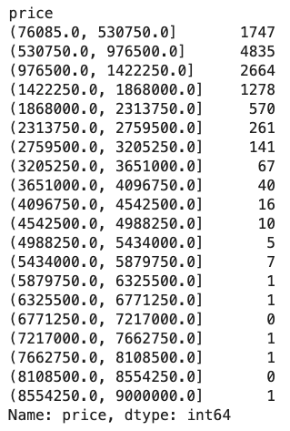

Al crear segmentos de exactamente el mismo tamaño, obviamente los conteos van a variar de segmento en segmento. En este caso queda bastante claro que el grueso de las muestras se encuentra concentrado en la parte baja del espectro. Esto es bastante ilustrativo, pero sería aún más si pudiéramos observarlo en una gráfica.

### Histogramas

Los histogramas son básicamente una tabla de frecuencias hecha gráfica. Tomas el rango de tus datos y eso lo conviertes en el eje x. Después, tomas el rango de conteos y eso lo conviertes en el eje y. Ahora, divides tu eje x en el número de segmentos deseados. Para finalizar, graficas cada segmento como una barra que mide la cantidad de muestras que están contenidas en ese segmento.

Mira cómo se ve nuestra tabla de frecuencias de precios hecha histograma:

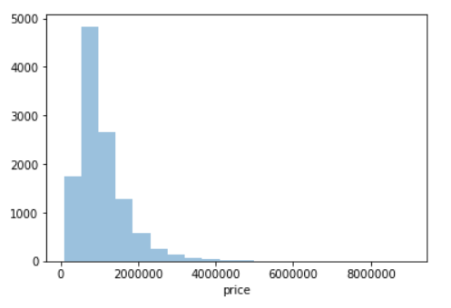

A pesar de que sólo es otra manera de ver la tabla de frecuencias, es mucho más intuitiva y nos ayuda a sacar aún más información que la que podemos ver en la tabla. Además, entre más segmentos tengas, se vuelve cada vez más difícil extraer información de la tabla de frecuencias. En cambio, con el histograma el aumento de segmentos no representa ningún problema:

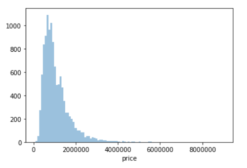

Vamos a aprovechar los histogramas para aprender algunos términos que nos sirven para describir a más detalle nuestras gráficas de distribuciones.

### Describiendo histogramas

Observar un histograma puede darnos mucha información acerca de la distribución de nuestro conjunto de datos, pero ¿cómo comunicamos nuestros hallazgos? Existen varios términos que nos sirven para describir la forma de los histogramas, de manera que sea sencillo describir una de estas gráficas sin tener que verla necesariamente.

Veamos algunos de estos términos.

#### Simétrica

Una distribución simétrica es la que, al ser dividida a la mitad por una línea, tiene un lado izquierdo prácticamente idéntico pero en espejo al lado derecho. Una distribución simétrica se ve más o menos así:

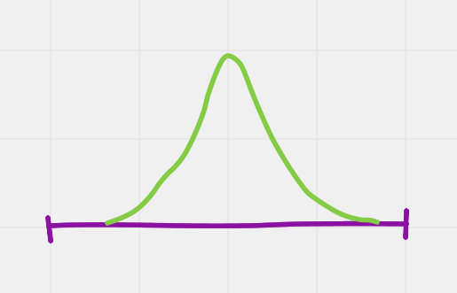

#### Normal

La distribución normal es una de las más utilizadas en el mundo de la estadística. Se utiliza muchas veces como estándar para comparar todas las demás distribuciones. La distribución normal tiene un promedio de 0 y una desviación estándar de 1, y es bastante simétrica:

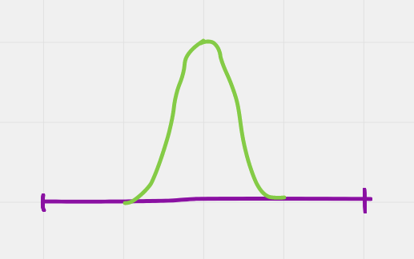

#### Asimétrica

Como su nombre lo dice, una distribución asimétrica es aquella que no puede ser dividida en dos partes idénticas (o casi idénticas). Una distribución tiene asimetría positiva (o a la derecha) cuando la "cola" a la derecha de la media es más larga que a la izquierda:

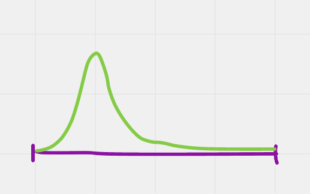

En cambio, una distribución tiene asimetría negativa (o a la izquierda) cuando la "cola" a la izquierda de la media es más larga que a la derecha:

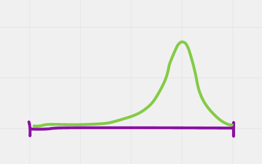

Nuestro histograma de precios tiene claramente asimetría positiva, pues la cola de la distribución es mucho más larga a la derecha de la media que a la izquierda.

##### Cola Larga

Las distribuciones de cola larga son aquéllas cuyas colas (o cola) se extienden mucho más allá de la mayoría de los datos:

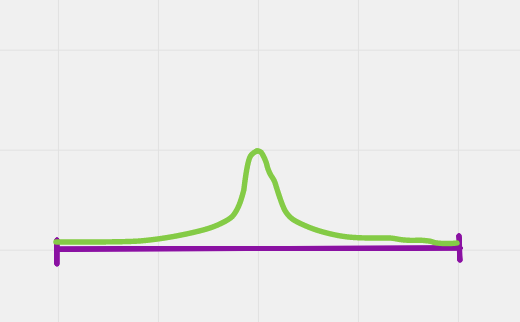

##### Cola Corta

A diferencia de las distribuciones de cola larga, las distribuciones de cola corta tienen colas que rápidamente se aproximan a un conteo de 0 alrededor de la media:

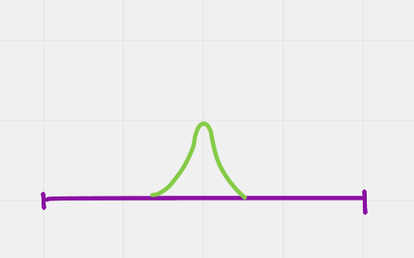

##### Uniforme (o Aproximadamente Uniforme)

Una distribución Uniforme o Aproximadamente Uniforme es aquélla donde la probabilidad de obtener alguno de los valores dentro del rango total es prácticamente la misma. Una distribución uniforme se ve así:

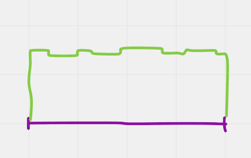

##### Bimodal

Una distribución bimodal tiene dos aglomeraciones de datos:

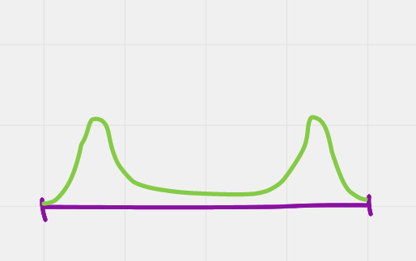

---

Si quieres aprender un poco más acerca de distribuciones, puedes checar los recursos que tiene [Khan Academy](https://es.khanacademy.org/math/ap-statistics/quantitative-data-ap/describing-comparing-distributions/v/classifying-distributions).

También puedes aprender un poco acerca de las medidas de asimetría y curtosis en [este link](http://www.spssfree.com/curso-de-spss/analisis-descriptivo/medidas-de-distribucion-curtosis-asimetria.html). **Estudiaremos este tema durante la clase, así que es conveniente que le eches un ojo a este artículo.**

---

Obviamente ésta no es una lista exhaustiva de todos los tipos distintos de distribuciones que existen, pero es suficiente como para que tengas herramientas para describir con más precisión tus histogramas.

### Gráficas de densidad

Por último vamos a aprender una variación del histograma que lleva por nombre gráfica de densidad. Podemos pensar en las gráficas de densidad como una versión "suavizada" de los histogramas:

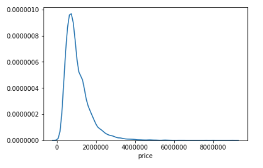

En una manera distinta de ver la información ofrecida por nuestro histograma, que nos da más claridad acerca de la "forma" de nuestra curva.

Además, el eje `y` cambia. En una gráfica de densidad el eje `y` no representa el conteo de nuestros segmentos sino la densidad de probabilidad. Explicar cómo funciona esto está fuera de nuestro tema, pero si quieres aprender más sobre cómo se estiman las gráficas de densidad, puedes [ir aquí](https://mathisonian.github.io/kde/) (ojo, el recurso está en inglés, ¡pero es muy bueno!).

Además de mostrarnos con mucha claridad la forma de nuestra distribución, una gráfica de densidad nos puede servir para comparar múltiples distribuciones en la misma gráfica:

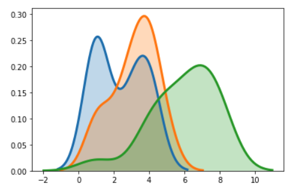

¡Genial!

---

Ésta fue una introducción teórica a las distribuciones de datos. Aprendimos cómo las visualizaciones pueden ser muy útiles para clarificar cómo están organizados nuestros datos. En el Work aprendemos la práctica de cómo usar Seaborn para explorar nuestros datos.

---

**Quiz**

1. En un diagrama de caja y bigotes, ¿qué percentiles representan los bordes de la caja?

* 25 - 50
* **25 - 75**
* 0 - 100
* 50 - 75
* 50 - 100

2. En un diagrama de caja y bigotes, ¿cuál es el tamaño máximo de los bigotes?

* **1.5 * Rango Intercuartílico**
* 1.5 * Rango Total
* 1.2 * Rango Intercuartílico
* Rango Intercuartílico ^ 2
* 1.5 * Mediana

3. En un histograma, ¿qué se grafica en el eje y?

* El rango de los valores
* Los percentiles
* El Rango Intercuartílico
* **La frecuencia de los valores**
* El logaritmo de los valores

4. ¿En qué caso decimos que una distribución tiene asimetría positiva?

* Cuando la "cola" a la izquierda de la media es más larga que a la derecha
* Cuando tenemos dos aglomeraciones de datos
* Cuando las colas se extienden mucho más allá de la mayoría de los datos
* Cuando la distribución tiene un promedio de 0 y una desviación estándar de 1
* **Cuando la "cola" a la derecha de la media es más larga que a la izquierda**

5. ¿Qué características tiene una distribución uniforme?

* Es aquélla donde es mucho más probable obtener datos cercanos a la media
* Es aquélla donde es mucho más probable obtener datos a la izquierda de la media
* Es aquélla donde la probabilidad de obtener alguno de los valores dentro del rango total es prácticamente la misma
* Es aquélla donde es mucho más probable obtener datos a la derecha de la media
* Es aquélla donde la probabilidad de obtener alguno de los valores dentro del Rango Intercuartílico es prácticamente la misma