
<strong>Curso Data Analysis - Módulo 4 PREWORK de Exploración de Variables Categóricas y Análisis Multivariable</strong>

<strong>PREWORK SESIÓN 3</strong>

### Introducción

La sesión pasada estuvimos explorando la distribución de variables numéricas discretas y continuas. Ahora vamos a aprender a analizar nuestras variables categóricas. Aprenderemos a calcular la moda, así como utilizar gráficas de barras, gráficas de caja y de violín para explorar la distribución de una o más variables categóricas.

También aprenderemos cómo hacer nuestras gráficas más comprensibles y detalladas usando títulos, anotaciones y leyendas. Esto es muy importante para que nuestras gráficas requieran poco contexto para ser interpretadas.

¡Vamos!

#### Objetivos

- Identificar distintas técnicas para explorar y visualizar variables categóricas.
- Añadir anotaciones a nuestras gráficas para hacerlas más comprensibles.
- Utilizar gráficas de barras.
- Graficar un conjunto de datos agrupado de acuerdo a dos variables categóricas.
- Producir más de una gráfica al mismo tiempo para compararlas.
- Graficar un conjunto de datos numéricos agrupados de acuerdo a una variable categórica.

---

### Gráficas anotadas

En la sesión pasada estuvimos creando varias gráficas, pero nunca nos preocupamos por las anotaciones sobre ellas. Sin títulos, nombres en los ejes y leyendas, se requiere entender el contexto y el código para poder interpretarlas. Obviamente esto no es lo mejor. La mayoría de nuestras gráficas las producimos no para nosotros sino para que otras personas puedan entender nuestros análisis. Por esta razón es muy importante hacer nuestras gráficas comprensibles y fáciles de interpretar. Aprendamos algunas añadiduras que podemos hacer para que nuestras gráficas sean más comprensibles. Por ahora no mostraremos el código que las creó, pero durante el Work aprenderás a hacerlo por ti mismo.

#### Títulos

Añadiendo un título a nuestra gráfica podemos hacer muy evidente cuál es el tema de nuestro análisis:

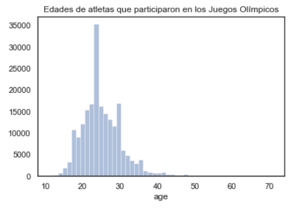

#### Nombres de ejes

También es importante asegurarnos de que los ejes tengan un nombre explicativo. En este caso, por ejemplo, si nuestra gráfica está dirigida a personas que sepan ciencia de datos, probablemente no haría falta anotar el eje y (porque está implícito en el tipo de gráfica que el eje y es el conteo), pero vamos a añadirlo para que cualquier persona pueda interpretarla:

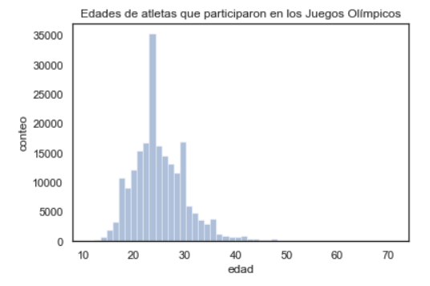

#### Leyendas

En el caso de que estemos graficando más de una categoría al mismo tiempo (por ejemplo, en las gráficas de densidad que hicimos para comparar dos distribuciones al mismo tiempo) es también muy importante añadir una leyenda para poder diferenciar nuestras categorías:

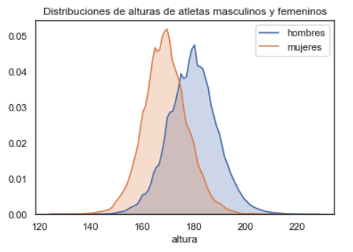

#### Tamaño de la gráfica

Es posible incrementar o disminuir el tamaño de las gráficas para que las visualizaciones tengan suficiente espacio. Por ejemplo, esta gráfica fue alargada verticalmente:

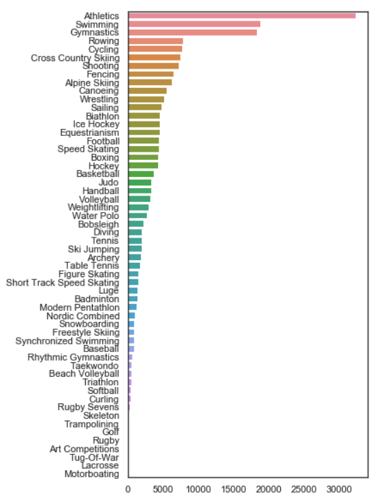

#### Dirección de los tics

También podemos cambiar la dirección de los tics (los nombres de cada anotación en el eje `x` o `y`), para que se acomoden mejor a la cantidad de nuestros datos:

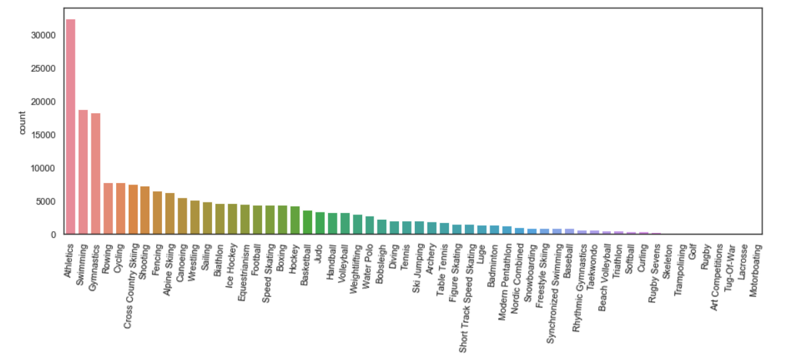

Esta gráfica fue alargada horizontalmente y los tics fueron girados 85˚ para que no chocaran los unos contra los otros.

---

Estas añadiduras básicas agregan información muy útil a nuestras gráficas y nos ayudan a dar más claridad, permitiendo que más personas puedan comprenderlas sin necesidad de una explicación extensa. En sesiones posteriores veremos además cómo embellecer nuestras gráficas para que sean al mismo tiempo informativas y atractivas.

---

### Gráficas de barras

Una de las gráficas más comunes en la prensa popular es la gráfica de barras. Tiene ciertas similitudes con los histogramas, pero veamos cuáles son las diferencias más importantes:

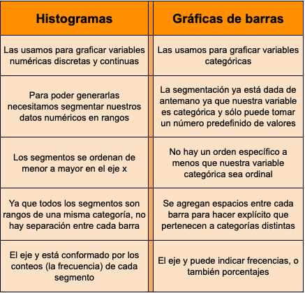

Algo interesante que podemos concluir de esto es que el proceso de generación de tablas de frecuencia e histogramas implica la conversión de nuestras variables numéricas en variables categóricas. Al segmentar nuestros datos numéricos en rangos, estamos generando categorías. Esto suele hacerse para reducir la complejidad de los datos y facilitar la comprensión.

En las gráficas de barras el eje `y` puede indicar frecuencia (como en los histogramas):

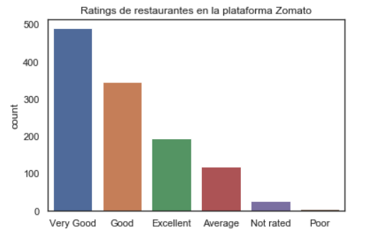

O también puede indicar la proporción o porcentaje de aparición de dicha categoría:

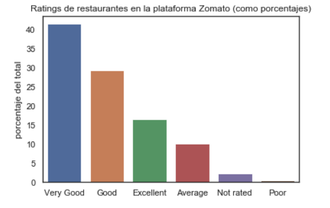

En una gráfica de barras es muy fácil comparar las distintas frecuencias de aparición entre categorías. Es fácil saber cuáles son las categorías predominantes y cuáles las poco comunes.

#### Gráficas de pie

Las gráficas de pie también son muy populares en la media popular como maneras de visualizar segmentos de un total. Pero hay múltiples razones por las que las gráficas de pie son en realidad muy poco informativas. Este tipo de gráficas no suele utilizarse en análisis más profesionales. Si quieres saber por qué, puedes leer [este artículo](https://www.perceptualedge.com/articles/visual_business_intelligence/save_the_pies_for_dessert.pdf).

### Moda

La moda es el valor (o los valores) categórico que más se repite en un conjunto de datos. Por ejemplo, en nuestra gráfica anterior la moda es la categoría "Very good".

Podemos saber la moda observando nuestra gráfica de barras o también computando el conteo de valores en nuestro conjunto. Haciendo esto en `pandas` obtenemos, por ejemplo, la siguiente tabla, donde podemos observar claramente la moda:

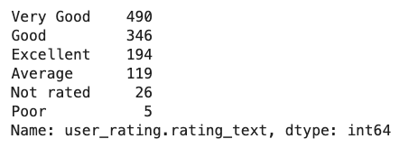

---

Como puedes ver, explorar variables categóricas se parece en cierta medida a la exploración de variables numéricas. Las gráficas de barras son análogas a los histogramas. Y la moda es análoga a la media o mediana en cuanto a que es el "valor típico" de nuestro dataset.

---

### Tablas de contingencia

Es muy común que tengamos más de una variable categórica en nuestro conjunto de datos. Cuando eso sucede, podemos llegar a necesitar un análisis de frecuencias tomando en cuenta dos o más de estas variables. Para eso podemos utilizar las tablas de contingencia. Una tabla de contingencia toma una de las variables categóricas como índice y otra (o más de una) de estas variables para crear columnas. Una tabla de contingencia es básicamente una tabla de conteos dividida por categorías.

Por ejemplo, en esta tabla hemos realizado un análisis más detallado que el que realizamos con nuestra gráfica de barras. En la gráfica de barras podíamos ver la distribución de la variable 'ratings', que era las evaluaciones que comensales habían hecho de diversos restaurantes. Podríamos, antes de calcular las distribuciones, separar nuestras muestras por el rango de precio de los restaurantes, que es una variable categórica con 4 valores posibles. Obtendríamos una tabla como ésta:

Ahora te preguntarás, ¿cómo podríamos graficar esta tabla de contingencia? Bueno, para eso necesitamos de hecho varias gráficas al mismo tiempo, una por cada variable del eje 0 (el índice). Quedaría algo así:

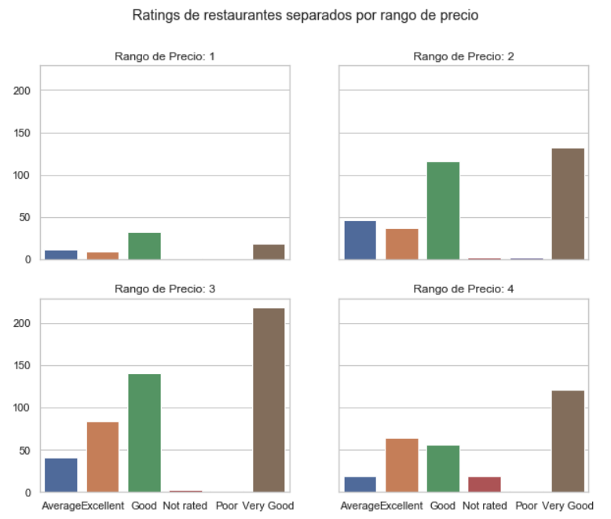

Como puedes ver, las gráficas comparten la escala del eje y para poder compararlas adecuadamente. En el work aprenderás cómo generar múltiples gráficas usando `matplotlib`.

### Boxplots

Hemos ya trabajado con boxplots para explorar la distribución de una variable numérica. ¿Qué hay de la distribución de una variable numérica separada por categorías? También los boxplots pueden ayudarnos visualizar eso. Así como las tablas de contigencia nos muestran el conteo de frecuencias utilizando dos o más variables categóricas, los boxplots sirven para explorar una variable numérica agrupada en categorías.

Recordarás que en la sesión pasada (y más atrás en este mismo Prework) graficamos las edades de atletas que han participado en los Juegos Olímpicos separándolas por género. Para hacer esto usamos gráficas de densidad. Si quisiéramos analizar las distribuciones con boxplots y compararlas al mismo tiempo podríamos hacer lo siguiente:

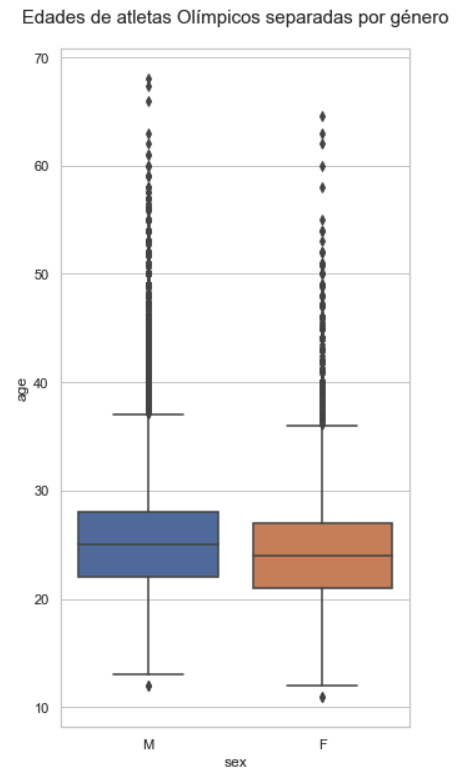

### Violinplots

Los violinplots son muy parecidos a los boxplots. La diferencia es que los violinplots grafican la densidad de frecuencia en lugar de las frecuencias como tal (piénsalos como gráficas de densidad mezcladas con boxplots). La ventaja que tienen sobre los boxplots es que nos permiten ver a mucho detalle la distribución de los datos. La desventaja es que no muestran con tanta claridad a los valores atípicos. La gráfica anterior usando violinplots se vería así:

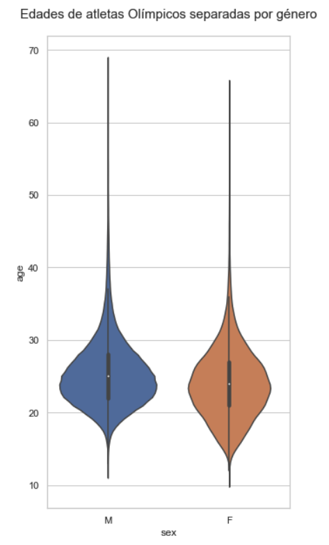

Como puedes ver, la distribución en las partes centrales queda mucho más clara con los violinplots que con los boxplots, pero es imposible ver los valores atípicos y dónde están localizados.

Ésta es una muestra más de cómo cada tipo de gráfica tiene sus ventajas y sus desventajas. Un científico de datos está siempre muy consciente de éstas y sabe cuándo usar cada gráfica para sacarle el mejor provecho posible.

---
