
<strong>Curso Data Analysis - Módulo 4 PREWORK de Correlaciones y Regresión Linear Simple</strong>

<strong>PREWORK SESIÓN 4</strong>

### Introducción

En las sesiones pasadas aprendimos cómo identificar valores típicos y atípicos en nuestros datos. Hemos aprendido a explorar la distribución de variables categóricas y numéricas. También conocimos algunas técnicas para realizar exploraciones multivariables de nuestros conjuntos de datos.

Ahora iremos a un tema que es algo distinto: correlaciones entre variables. Una correlación entre dos variables implica que existe un cierto nivel de dependencia entre ellas. Si una de las variables cambia de valor, la otra cambia también de una forma parcialmente predecible.

Vamos a aprender algo de teoría relacionada a correlaciones, así como también el uso de diversas gráficas que hacen muy evidente las dependencias o la inexistencia de éstas.

#### Objetivos

- Entender el concepto de correlación entre variables y por qué es relevante.
- Identificar el significado del coeficiente de correlación e interpretarlo interpretarlo.
- Hacer matrices de correlaciones y a graficarlas usando heatmaps.
- Hacer gráficas de dispersión e interpretarlas.
- Aprender el concepto de Gráficas de Pares.
- Aprender el concepto de Regresión Linear Simple y cómo funciona el proceso de entrenamiento e interpretación.

---

### ¿Qué es entonces una correlación?

Entonces, ¿qué es exactamente una correlación entre dos variables? Decimos que dos variables están correlacionadas positivamente si el aumento de valores en una de ellas está relacionado con el aumento de valores en la otra. De igual forma, también están correlacionadas positivamente si la disminución de valores en una de ellas está relacionado con la disminución de valores en la otra.

En cambio, decimos que está correlacionadas negativamente si el aumento en los valores de una está relacionado a la disminución de los valores en la otra, y viceversa.

Si dos variables están correlacionadas podemos intuir que existe cierto nivel de dependencia directa o indirecta entre ellas. ¿Tal vez el aumento en los valores de una *causa* el aumento de valores en la otra? ¿O tal vez hay una tercera variable que es la *causante* del cambio en ambas variables? Como seguramente ya habrás escuchado: 'correlación no implica causalidad'. Esto quiere decir que el hecho de que nuestras variables estén correlacionadas no implica que el cambio de valores en una *cause* el cambio de valores en la otra. Vamos, ni siquiera significa que su relación sea explicable. ¡La relación podría ser un efecto de la aleatoriedad!

Aunque no podemos hacer suposiciones tan rápidamente acerca de qué significa una correlación, saber que existe nos pone en el camino del descubrimiento de la naturaleza de esta relación. En esta sesión aprenderemos a medir la fuerza y dirección de las correlaciones entre dos variables.

### Coeficiente de correlación

Existen muchas ecuaciones para calcular matemáticamente la correlación entre dos variables. Hoy vamos a aprender una de las más comunes: El Coeficiente de Correlación de Pearson. Este coeficiente sólo nos sirve para calcular la correlación entre dos variables numéricas, ya que depende de la desviación estándar de nuestras variables.

En este Prework no vamos a aprender la ecuación del Coeficiente de Correlación de Pearson, pero si quieres aprender cómo calcularlo paso a paso, puedes ir a [este link](https://bookdown.org/dietrichson/metodos-cuantitativos/coeficientes-de-correlacion.html). En ese link también podrás aprender otras maneras de calcular correlaciones que sirven para otro tipo de datos.

Para motivos de esta clase, basta con saber que el coeficiente de correlación de Pearson es un valor entre -1 y 1. Un valor de -1 indica una correlación negativa perfecta entre nuestras variables, es decir que si una aumenta, la otra disminuye en la misma proporción. Un valor de 1 indica una correlación positiva perfecta entre las variables, es decir que si una aumenta, la otra aumenta en la misma proporción. Un valor de 0 indica que no hay ninguna correlación entre las variables (es decir, son totalmente independientes).

Para que el coeficiente de correlación de Pearson sea capaz de encontrar la relación entre dos variables (si esta relación existe), la relación tiene que ser lineal. Esto quiere decir que la relación entre las variables puede describirse usando una línea recta. Por ejemplo, digamos que en esta gráfica hemos representado la relación lineal entre dos variables `x` y `y`:

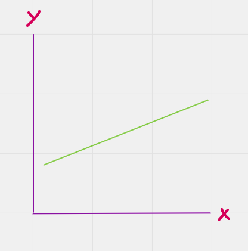

Elijamos un punto en esta linea, que representa un valor de `x` y un valor de `y`:

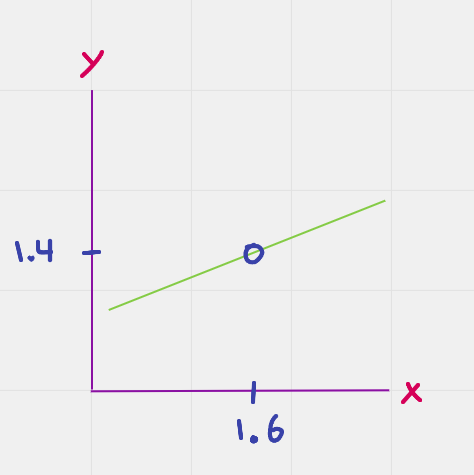

Moviéndonos a través de esta línea podemos observar que si el valor de `x` aumenta, el valor de `y` aumenta también:

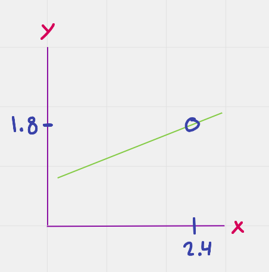

De igual manera, si el valor de `x` disminuye, el valor de `y` también lo hace:

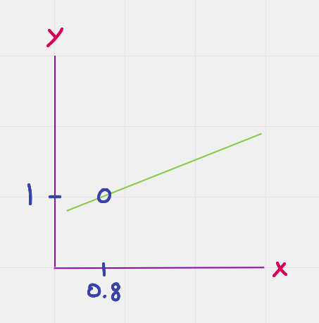

Esto significa tener una relación lineal. Lo que acabamos de ver es una correlación positiva perfecta, es decir, lo que sería un valor de 1 en el coeficiente de Pearson. La correlación sería negativa perfecta si pudiéramos representarla con una línea como ésta:

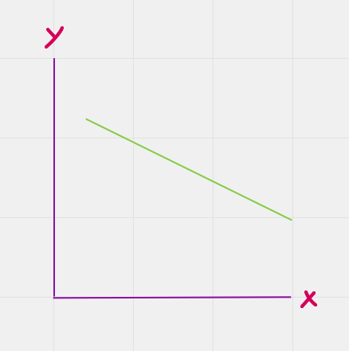

En este caso, conforme una variable aumenta la otra disminuye, y viceversa. Esto tendría un coeficiente de Pearson de -1.

Obviamente en la vida real encontrar correlaciones perfectas es prácticamente imposible. Esto quiere decir que en los datasets que analices no vas a encontrar nunca correlaciones de -1 y 1. Un coeficiente de 0.7, por ejemplo, significa que tienes una correlación bastante fuerte pero no perfecta. Un coeficiente de -0.2 significa que tu correlación es negativa y bastante débil, lo cual podría incluso indicar que es una relación debida al azar. Entonces, el coeficiente de correlación de Pearson no solamente nos indica si la correalación es negativa o positiva, sino también la fuerza de esa correlación.

Es importante notar que la correlación entre las dos variables no tiene dirección. Es decir, una correlación positiva indica que si la variable `x` aumenta, la variable `y` también aumenta. **PERO** la relación es igual si lo vemos desde la perspectiva de la variable `y`: si la variable `y` aumenta, la variable `x` también.

### Matriz de correlaciones

Una manera muy común de representar las relaciones que existen en un dataset es usando una matriz de correlación. Para realizar un ejemplo, tomemos el dataset 'diabetes-clean.csv' que ya hemos usado anteriormente. Este dataset, como recordarás, tiene datos acerca de pacientes con ascendencia Pima que han sido diagnósticados sanos o con diabetes. Usando pandas para generar la matriz de correlación obtenemos lo siguiente:

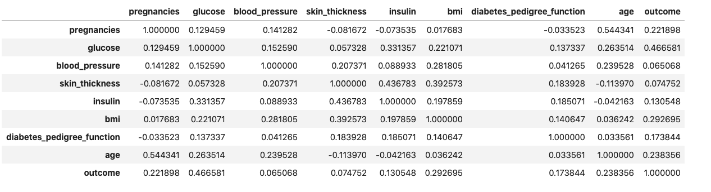

Cada celda representa la intersección entre la columna y la fila correspondiente. El valor que contiene es el coeficiente de correlación de Pearson. Observa que hay una línea diagonal justo a la mitad de la matriz que contiene puros 1s. Esta diagonal es la intersección de cada variable consigo misma, por lo que obviamente la correlación es perfecta. También observa la redundancia en los datos arriba y debajo de la diagonal.

### Heatmaps o Mapas de Calor

Resulta algo complicado visualizar las correlaciones usando la matriz de correlaciones. Algo que podemos hacer para ayudarle un poco a nuestros ojos es usar un mapa de calor o heatmap para representar visualmente nuestra matriz de correlaciones:

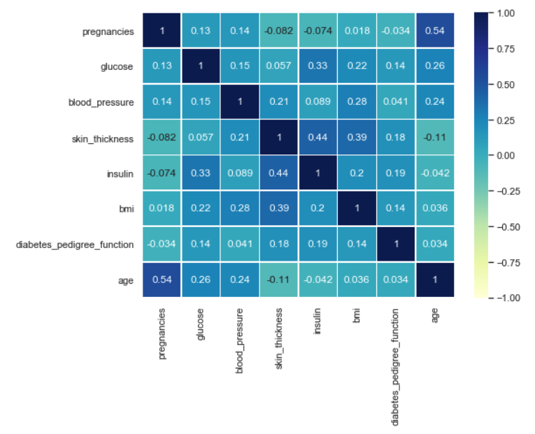

La barra de la derecha nos indica nuestro rango posible y los colores que le corresponden a cada rango. Como puedes observar, no hay ninguna relación que se acerque siquiera a una correlación negativa. Hay algunas correlaciones positivas con valores moderados. Las más significativas son las que existen entre las variables 'age' y 'pregnancies' y entre las variables 'insulin' y 'skin_thickness'.

Notarás que removí la variable 'outcome'. A pesar de que ésta es la variable dependiente y la que determina si un paciente fue clasificado como enfermo o sano, decidí removerla por que es una variable binaria. Si recuerdas, el coeficiente de correlación de Pearson sólo es efectivo con variables numéricas, por lo que no tiene caso buscar este tipo de correlación usando variables binarias.

Es importante también recalcar lo siguiente:

1. El coeficiente de correlación de Pearson es muy sensible a valores atípicos, así que siempre hay que asegurarse de que la carencia (o existencia) de una relación suceda 'a pesar' de los valores atípicos y no debido a ellos.
2. El hecho de que el coeficiente de correlación de Pearson sea cercano a 0 no significa que no hay **ninguna correlación posible** entre dos variables. Meramente significa que **no existe una relación lineal** entre las variables. Si quieres conocer algunas otras maneras de cuantificar relaciones entre variables puedes [ir aquí](https://bookdown.org/dietrichson/metodos-cuantitativos/coeficientes-de-correlacion.html)(ojo, es el mismo link de hace rato) [o aquí](https://www.fisterra.com/formacion/metodologia-investigacion/relacion-entre-variables-cuantitativas/#:~:text=Determinar%20si%20las%20dos%20variables,determinado%20de%20la%20otra%20variable.).

### Scatterplots o Gráficas de Dispersión

Ok, ya sabemos cómo cuantificar la correlación entre dos variables usando el coeficiente de correlación de Pearson. Ahora veremos una manera de visualizar dicha relación entre dos variables. Los scatterplots grafican una de las variables en el eje x y la otra variable en el eje y de un plano cartesiano. Cada muestra es un punto en el plano que tiene su respectivo valor para x y para y. Por ejemplo, visualicemos la relación entre las variables 'age' y 'pregnancies':

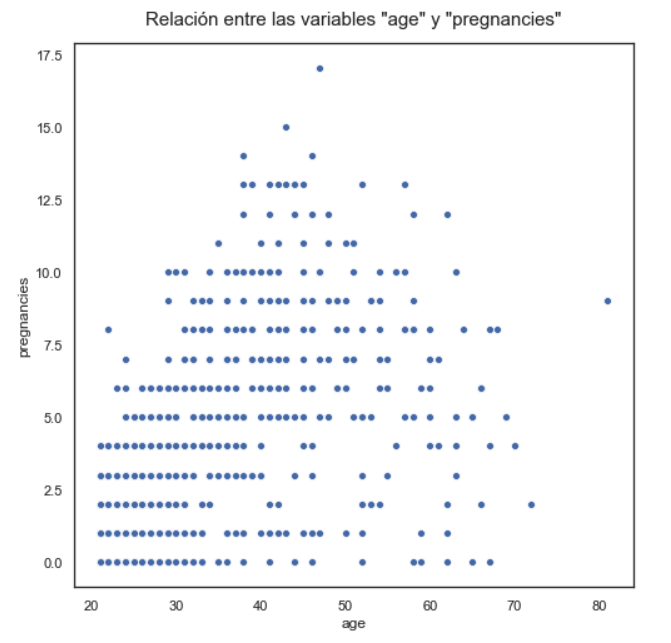

¿Qué significa visualizar la relación entre dos variables? Bueno, que podemos en nuestras mentes (o literalmente) dibujar una línea que parece que podría representar la correlación existente entre dos variables. Por ejemplo, en este caso podríamos imaginar una línea así:

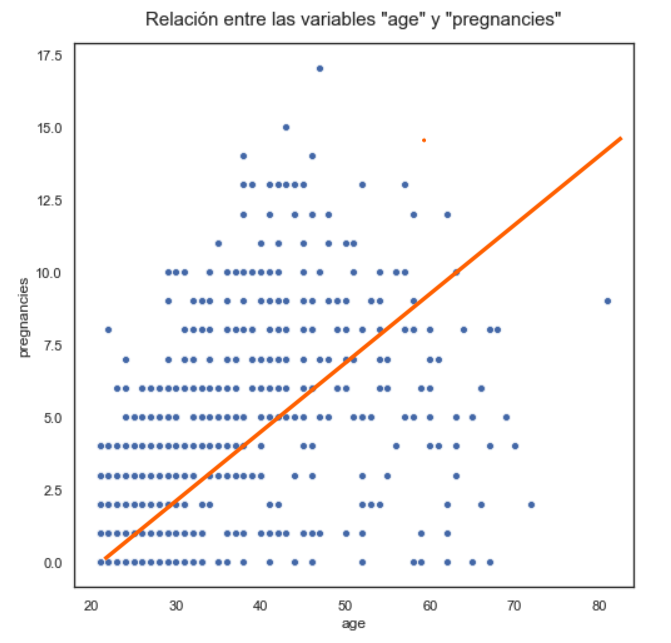

Esta relación no es para nada perfecta. Pero si recuerdas, el coeficiente de correlación de Pearson entre estas dos variables es de 0.54, por lo que a pesar de no ser perfecta, podríamos decir que "existe cierta tendencia" de dependendencia entre ambas. La línea que acabamos de dibujar muestra una tendencia puesto que sí podemos inferir a partir de la gráfica que muchas veces un aumento en la variable x es correspondido por un aumento en la variable y.

### Pairplots o Gráficas de Pares

Seaborn tiene un método que facilita muchísimo la visualización de las relaciones entre múltiples variables. De una forma muy similar a las matrices de correlación, los pairplots usan gráficas de dispersión (scatterplots) para graficar todas las posibles combinaciones de relaciones entre las variables de un dataset:

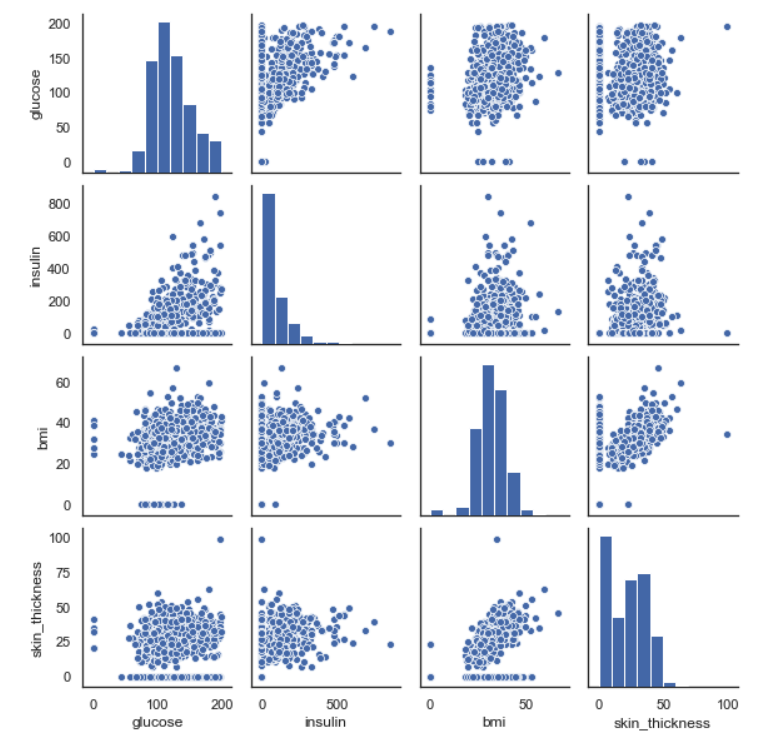

> Sólo fueron graficadas algunas de las variables, para que la gráfica no tuviera un tamaño excesivo.

En la diagonal, la intersección de una variable consigo misma, las gráficas de pares colocan un histograma de la variable. Observa las relaciones entre 'insulin' y 'glucose', y también entre 'bmi' y 'skin_thickness'. ¿Parece que hay una relación por ahí, no es así? Recordemos que la relación entre 'insulin' y 'glucose' tiene un coeficiente de correlación de 0.33; de igual manera, 'bmi' y 'skin_thickness' tienen un coeficiente de 0.39.

### Regresión Lineal Simple

Hemos visto que el coeficiente de correlación de Pearson cuantifica la fuerza de la relación entre dos variables y la dirección de ésta (positiva o negativa). Si la relación es suficientemente fuerte, en teoría podríamos predecir una de las variables usando la otra. La regresión lineal simple es el proceso a través del cual intentamos crear una ecuación que pueda predecir una variable utilizando la otra como punto de partida. Lo interesante es que dicha ecuación representa (lo adiviniste) una línea en un plano.

Una línea en un plano se ve así:

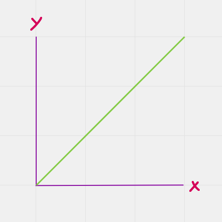

Recordarás de tus clases de matemáticas que la ecuación de una línea en un plano se ve así:

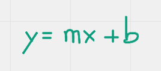

Esto quiere decir que para obtener cada valor `y` tenemos que tomar el valor correspondiente de `x`, multiplicarlo por un *coeficiente* `m` y luego sumarle un *intercepto* `b`. El objetivo de la regresión linear es encontrar los valores para `m` y `b`. Al encontrarlos, en teoría podemos usar `x` para predecir `y`. Como ya hemos dicho varias veces, en la vida real es prácticamente imposible encontrar una correlación perfecta, por lo que la predicción que hagamos nunca va a ser exacta. Por supuesto, entre más fuerte sea la relación entre dos variables, más precisa será la predicción.

Por ejemplo, digamos que tenemos el siguiente scatterplot:

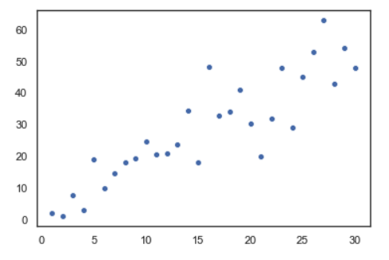

Si cuantificamos el coeficiente de correlación de Pearson obtenemos un valor de `0.8849529343548095`. Esto quiere decir que la correlación es positiva y que es bastante fuerte. Veamos qué tan bien podemos predecir una utilizando la otra.

Para hacer una regresión linear simple tenemos que decidir cuál de las dos variables es la *independiente* y cuál la *dependiente*. La variable independiente (la variable `x` o 'feature' en inglés) es la que vamos a utilizar para predecir a la otra. La variable dependiente (la variable `y` o 'target' en inglés) es la que vamos a intentar predecir. Usaremos una librería llamada [scikit-learn](https://scikit-learn.org/stable/) para realizar la regresión linear. El proceso a través del cual encontramos los valores para el *coeficiente m* y el *intercepto b* se llama 'entrenamiento'. El algoritmo y los parámetros que estamos utilizando (en este caso los que definen **cómo** llevar a cabo la regresión linear) los llamamos el *modelo*.

Una vez entrenado el modelo, podemos graficar la línea obtenida y compararla con nuestros puntos:

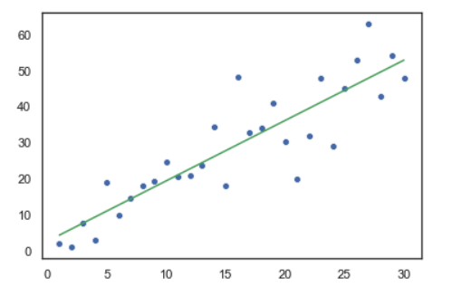

Las diferencias que hay entre los puntos y la línea, ése es nuestro margen de error. Obviamente el proceso de entrenamiento busca minimizar la distancia entre los puntos y la línea, pero siempre hay un margen de error que debemos de considerar. Una de las medidas que utilizamos para medir la efectividad de nuestro modelo es el llamado `coeficiente de determinación` o `R2` (`R squared`). ¡En el caso de la Regresión Linear Simple `R2` es el cuadrado de nuestro coeficiente de correlación de Pearson! Esto quiere decir que en este caso nuestro `R2` es de `0.7831416960231877`.

Como podrás imaginar, `R2` es un valor entre el rango 0 y 1 (pues al elevar cualquier número al cuadrado eliminamos los signos negativos). Podemos interpretarlo como 'qué tanta variación de la variable `y` podemos explicar utilizando la variable `x`'.

Usando nuestro modelo entrenado, si quisiéramos predecir el valor de `y` cuando `x` es 10, tendríamos que revisar nuestra línea y ver qué valores para `y` tenemos en este punto:

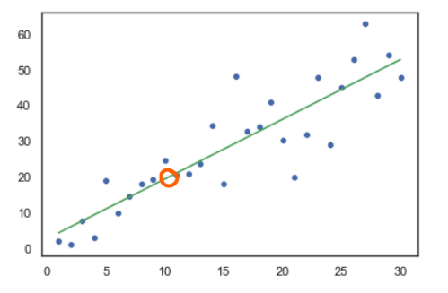

Como puedes ver, el valor 'real' de `y` queda un poco por encima de la línea, así es que nuestra predicción es un poco menor al valor 'real'.

Si quisiéramos predecir el valor de `y` cuando `x` es 20, revisaríamos el valor de `y` en el siguiente punto:

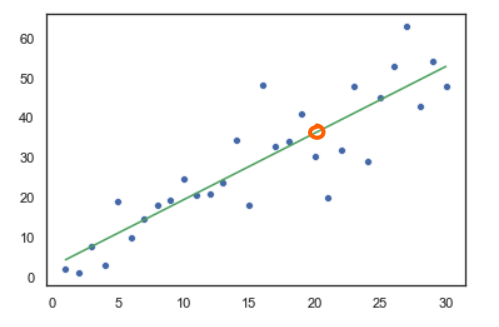

En este caso, el valor 'real' queda por debajo de la predicción.

Nuestras predicciones del mundo real nunca van a ser 100% precisas, dado que el universo es un lugar muy complejo. Si tenemos un modelo como el que acabamos de entrenar, con un `R2` de `0.7831416960231877`, podemos considerarnos sumamente afortunados. ¡Este `R2` significa que podemos explicar un 78% de la variación de `y` usando solamente la variable `x`! ¡Eso es bastante genial!

Si quieres profundizar en el concepto y aplicación de la Regresión Linear Simple, puedes [leer este tutorial](https://www.aprendemachinelearning.com/regresion-lineal-en-espanol-con-python/). Si quieres acercarte un poco más a las matemáticas utilizadas para realizar este proceso, puedes [estudiar estos materiales de Khan Academy](https://es.khanacademy.org/math/statistics-probability/describing-relationships-quantitative-data/regression-library/a/introduction-to-residuals).

---

**Quiz**

1. ¿Qué significa que dos variables estén correlacionadas positivamente?

* Que el aumento de valores en una de ellas está relacionado con la disminución de valores en la otra
* Que un cambio en una variable causa un cambio en la otra variable
* **Que el aumento de valores en una de ellas está relacionado con el aumento de valores en la otra**
* Que las dos variables son totalmente independientes
* Que la disminución de valores en una de ellas está relacionado con el aumento de valores en la otra

2. ¿Qué significa un valor de -1 en un coeficiente de correlación de Pearson?

* Indica una correlación positiva perfecta entre nuestras variables: si una disminuye, la otra disminuye en la misma proporción
* **Indica una correlación negativa perfecta entre nuestras variables: si una aumenta, la otra disminuye en la misma proporción**
* Indica una correlación positiva perfecta entre nuestras variables: si una aumenta, la otra aumenta en la misma proporción
* Indica una correlación negativa perfecta entre nuestras variables: si una aumenta, la otra aumenta en la misma proporción
* Indica una correlación negativa perfecta entre nuestras variables: si una disminuye, la otra disminuye en la misma proporción

3. ¿Qué podemos concluir si obtenemos un coeficiente de correlación de Pearson con valor 0?

* Que el cambio en una de las variables causa un cambio en la otra
* Que no existe ningún tipo de relación entre las dos variables
* Que existe una correlación de tipo positivo perfecto
* Que no existe una relación polinomial entre las dos variables
* **Que no existe una relación lineal entre las dos variables**

4. ¿Qué es una variable *dependiente*?

* **Es la variable que estamos intentando predecir usando un modelo de Regresión Lineal Simple**
* Es la variable que aumenta si todas las demás variables aumentan
* Es la variable que causa cambios en las demás variables
* Es la variable que usamos para predecir otra variable en un modelo de Regresión Lineal Simple
* Es la variable que aumenta si todas las demás disminuyen

5. ¿Qué explica el valor del coeficiente de determinación (R2)?

* Si la correlación entre dos variables es positiva o negativa
* Qué tanta variación de la variable `x` podemos explicar utilizando la variable `y`
* Si el coeficiente de correlación de Pearson es el algoritmo adecuado para nuestro problema
* **Qué tanta variación de la variable `y` podemos explicar utilizando la variable `x`**
* Qué tanta variación de la variable `y` podemos explicar utilizando la misma variable `y`