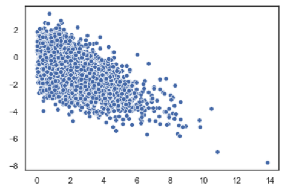
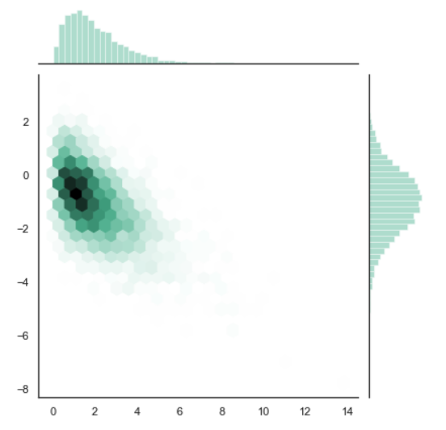

#### Binnings Hexagonales

Podrás imaginar que cuando tenemos muchísimos datos, una gráfica de dispersión puede volverse algo confusa. Por ejemplo, mira esta gráfica de dispersión que incluye 5000 muestras:

Sí, podemos apreciar que hay cierta tendencia, pero es imposible discernir la densidad de los puntos en las secciones donde tenemos una gran acumulación de estos.

Los binnings hexagonales lo que hacen es dividir el plano cartesiano en un número definido de 'bins' (segmentos). Cada 'bin' tiene forma de hexágono, de ahí el nombre de la gráfica. Después, en lugar de graficar cada muestra como un punto, definen la cantidad de puntos que se encuentran dentro de cada hexágono y eso se vuelve la densidad de dicho hexágono. Cada hexágono se rellena de un color que representa la densidad de puntos en dicho hexágono.

Por ejemplo, este es el mismo dataset pero graficado usando un binning hexagonal:

Es de notar que además de la relación entre los datos (que vemos en los hexágonos de colores), también tenemos histogramas de cada una de las variables. El histograma de la derecha corresponde a la variable en el eje y mientras que el histograma superior corresponde a la variable en el eje x. De esta manera podemos ver con más claridad cuál de las dos variables está influyendo más en los hexágonos que tienen una concentración más elevada.