
<strong>Curso Data Analysis - Módulo 4 PREWORK de Distribuciones muestrales y técnicas de evaluación de modelos</strong>

<strong>PREWORK SESIÓN 5</strong>

### Introducción

En esta sesión vamos a hablar acerca de qué son los sesgos, por qué aparecen en nuestros datos y qué podemos hacer para no ser confundidos por ellos. También hablaremos un poco más a detalle acerca de la diferencia entre poblaciones y muestras.

Aprovecharemos también el tema de los sesgos para aprender algunas técnicas de evaluación de modelos que pueden sernos muy útiles a la hora de entrenar modelos predictivos.

#### Objetivos

- Distinguir la diferencia entre población y muestra.
- Entender el concepto de 'sesgos' y por qué es tan importante estar conscientes de ellos.
- Aprender el concepto de muestreo aleatorio y cómo puede protegernos parcialmente de los sesgos.
- Utilizar la técnica 'bootstrap' como medio para explorar la distribución muestral de una estadística.
- Crear y utilizar histogramas, errores estándar e intervalos de confianza para evaluar la incertidumbre de una medida estadística.
- Utilizar técnicas para evitar sesgos en el entrenamiento de modelos, como la división de datasets y la validación cruzada.

---

### Poblaciones y muestras

#### Población

En un estudio estadístico la *población* es el grupo completo acerca del cual se pretende obtener cierta información. No necesariamente tienen que ser personas. Podemos tener edades, medidas de temperatura, ecosistemas, aparatos electrónicos, etc. Es posible obtener información acerca de cualquier objeto o fenómeno en el universo.

Es importante tener parámetros claros acerca de cuál es tu población. Por ejemplo, si yo decido hacer un estudio donde mi población sean "todas las mujeres en el Planeta Tierra", podría ser difícil estudiar características que realmente todas ellas compartan. De igual manera, no es posible tomar muestras de cada una de las mujeres en el planeta, y por lo tanto lo más probable es que vaya a tener que realizar el estudio sobre un número reducido de mujeres. Si decido hacer un estudio donde la población sean "mujeres mexicanas residentes de la Ciudad de México", entonces esa población se vuelve más manejable.

Hay algunos casos en los que puedes tener acceso a la población completa, sobre todo si tu población está suficientemente definida. Por ejemplo, si quiero hacer un estudio donde mi población sea las alturas de todas las atletas mujeres que han participado en Juegos Olímpicos, es probable que sí pueda obtener un dataset que contenga los datos del total de mi población. Obviamente, los resultados obtenidos de dicho estudio no podrían ser tan fácilmente generalizados a "todas las mujeres atletas en el mundo", y menos todavía a "todas las mujeres en el mundo". Entre más específica sea mi población, es más probable que pueda tener acceso a la totalidad de la población para realizar mi estudio.

#### Muestra

Afortunadamente, tener datos acerca de **toda** la población no es la única manera de obtener información valiosa acerca de ella. Una *muestra* es cualquier parte de una población que está bien definida. Una muestra podría incluir 1 solo objeto, persona o medición; también podría incluir la mitad de toda la población; o cualquier cantidad que no sea el total.

En los casos donde no tengamos acceso a los datos de toda la población completa, podemos preguntarnos si es posible obtener una muestra de esa población que sea representativa de la población total. Para que la muestra sea representativa debe de incluir todas las variaciones que encontraríamos en la población. Por ejemplo, si estamos estudiando "artistas visuales en la Colonia del Valle" tenemos que asegurarnos de que la muestra que tomemos tenga iguales (o similares) cantidades de hombres y mujeres, personas provenientes de distintos niveles socioeconómicos, personas con diferentes niveles de estudios, etc. Si nuestra muestra tiene 90% de hombres y 10% de mujeres, la información que obtengamos va a hablarnos acerca de las características de los "hombres artistas visuales en la Colonia del Valle", pero no realmente acerca de las mujeres.

En esta sesión vamos a aprender cómo tener cierta confianza en que el estudio estadístico de una muestra puede generalizarse a toda una población. Por ahora, lo más importante es que te haya quedado claro que:

1. La población es el grupo total de sujetos, fenómenos o mediciones del cual queremos obtener información.
2. Una muestra es un subconjunto (una parte) del total de la población.

### Sesgos en nuestros conjuntos de datos

Con el ejemplo de los artistas visuales en la Ciudad de México podrás imaginarte que es muy fácil cometer el error de trabajar con muestras que no son realmente representativas de la población. Cuando tenemos una muestra que no es representativa (por ejemplo con 90% de hombres y 10% de mujeres) tenemos un conjunto de datos *sesgado*. Un sesgo es una tendencia de nuestros datos. En este caso es una tendencia hacia favorecer la existencia de hombres en nuestro conjunto. Normalmente los sesgos van en contra de la racionalidad y en el caso de la estadística, los sesgos van en contra de nuestra capacidad de obtener información acerca de una población a partir de una muestra.

No siempre podemos deshacernos de un sesgo en nuestros datos, pero al menos es muy importante saber que el sesgo está presente. Hay algunas maneras en las que podemos resguardarnos de los sesgos. Una de ellas es el *muestreo randomizado*.

#### Muestreo aleatorio o randomizado

Un muestreo aleatorio implica tomar elementos de nuestra población de manera aleatoria con el fin de generar una muestra. Cada elemento debe de tener la misma probabilidad de ser seleccionado, con el fin de evitar en lo posible la creación de muestras sesgadas.

- Podemos realizar el muestreo *sin reposición de elementos*, es decir: cada vez que extraemos un elemento de la población no lo ponemos de regreso.
- Pero también podemos realizar el muestreo *con reposición*, es decir: después de extraer un elemento y agregarlo a la muestra, el elemento se pone de regreso en la población o muestra original. En este caso, podemos tener elementos repetidos en la muestra resultante.

Para leer un poco acerca de la importancia de realizar muestreos aleatorios puedes leer este [ejemplo de la vida real](http://www.capitalcentury.com/1935.html)(ojo: el artículo está en inglés).

Realizar muestreos aleatorios nos protege además de los sesgos particulares que puede tener la persona que está generando el dataset. Si pones a un ser humano a elegir qué elementos tomar de una población para generar un dataset, lo más probable es que vaya a incurrir en algo llamado *sesgo de selección*, donde las tendencias del seleccionador van a ocasionar que los elementos no sean seleccionados de manera imparcial.

### Distribuciones muestrales de estadísticas

Cuando tenemos un dataset en nuestras manos, lo más probable es que los datos incluidos en ese dataset sean una muestra de toda la población existente. En este caso debemos de preguntarnos si las medidas estadísticas que obtengamos son realmente representativas de la población. Normalmente es muy difícil (o imposible) regresar al origen de nuestra muestra para extraer más muestras y poder compararlas unas con otras. Además, normalmente queremos aprovechar la mayoría de los datos que tenemos para obtener una medida estadística precisa. Es por eso que se usan algunas técnicas que nos permiten "fingir" este re-muestreo utilizando solamente los datos que tenemos a la mano. Una de esas técnicas es la llamada *bootstrap*.

#### Bootstrap

La técnica de *bootstrapping* se utiliza para obtener distintas muestras a partir de la muestra que tenemos en nuestras manos y obtener un valor que nos indique qué tanta incertidumbre hay en la medida estadística que hemos realizado. Podrías pensarlo como: "Si pudiera regresar al origen de mis datos y tomar más muestras de mi población, ¿qué tanta diferencia esperaría obtener en el cálculo de esta medida estadística entre las diferentes muestras?". Utilizar el *boostrap* te puede dar una idea de qué tanto puedes confiar en tu medida estadística.

Los pasos para realizar un *boostrap* son los siguientes:

1. Toma un elemento de tu conjunto de datos de manera aleatoria con reposición.
2. Repite el paso 1 `n` veces (entre más cerca esté `n` a la longitud total de tu muestra, mejor).
3. Toma la medida estadística que te interese de tus valores remuestreados.
4. Repite los pasos 1 a 3 `R` veces (entre mayor sea `R`, mejor).
5. Utiliza las medidas obtenidas para:
  a) Generar un histograma o boxplot
  b) Calcular el error estándar
  c) Calcular un intervalo de confianza
  
Nuestro cálculo va a resultar más exacto si `n` y `R` son lo más grandes posibles. Pero el boostrapping es un proceso que toma mucho tiempo y poder computacional, así que si nuestro dataset es muy grande habrá que disminuir estos valores hasta que el procedimiento completo tome una cantidad decente de tiempo.

Vamos a ver cómo funciona esto con un pequeño ejemplo. Tenemos el siguiente dataset:

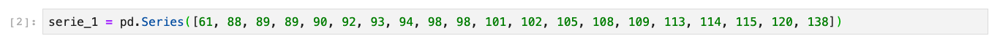

En este caso nuestro dataset es muy pequeño así que podemos sacar la media y la mediana para tener algunos estimados de locación:

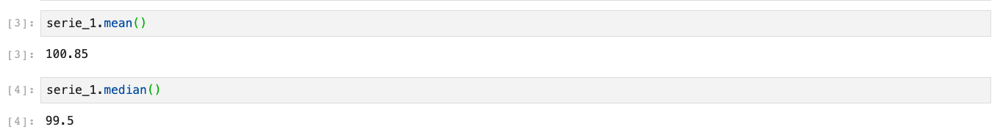

Digamos que este dataset es una muestra de una población, así que sabemos que podría no ser representativo de nuestra población. Queremos saber que tanta incertidumbre hay en nuestras medidas de media y mediana. Usamos bootstrap para "simular" nuevas muestras tomadas de la población total original. Vamos a obtener 100 000 muestras aleatorias con reposición y calcular la media y la mediana de cada una de éstas:

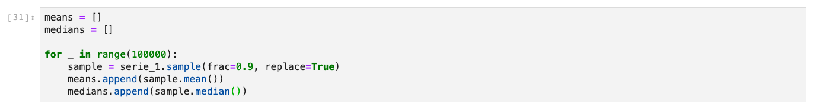

Listo, hemos realizado del paso 1 al 4. Vamos a explorar las posibilidades mencionadas en el paso 5 para entender qué información podemos obtener de cada una.

##### Histogramas

Resulta interesante que si graficamos nuestras `R` medidas estadísticas obtenidas durante el proceso de bootstrapping, muchas veces (aunque no siempre) el histograma resultante va a acercarse a una distribución normal. Esto tiene sentido si interpretamos este resultado como: "la mayoría de nuestras muestras va a ser similar, pero habrá algunas que estarán sesgadas hacia los valores pequeños o hacia los valores grandes". Si la distribución obtenida es muy distinta de la normal, podemos asumir que nuestra muestra está muy sesgada, que no hemos realizado un número de muestreos suficiente o que las muestras que estamos tomando son muy pequeñas (o una combinación de éstas).

Esta tendencia que tienen las distribuciones muestrales de estadísticas de parecerse a la distribución normal se llama el *Teorema del límite central*. En estadística tradicional, antes de que todos tuviéramos computadoras personales con bastante poder computacional, los estadistas dependían mucho de este teorema para explorar la distribución muestral de una estadística. Hoy en día, gracias al poder computacional que tenemos en nuestras manos, podemos utilizar el bootstrapping para conocer la "verdadera" distribución muestral de nuestra estadística sin tener que "asumir" que es normal.

Repito una vez más: si la distribución obtenida diverge mucho de la distribución normal podemos hacer 3 suposiciones:

1. O nuestra muestra original está muy sesgada y resulta en una distribución asimétrica.
2. O hemos realizado un número muy pequeño de muestreos y por lo tanto no tenemos una estimación precisa.
3. O las muestras que estamos tomando son muy pequeñas y facilitan la aparición de sesgos en nuestra distribución resultante.

Vamos a ver la distribución muestral de la media en nuestro ejemplo:

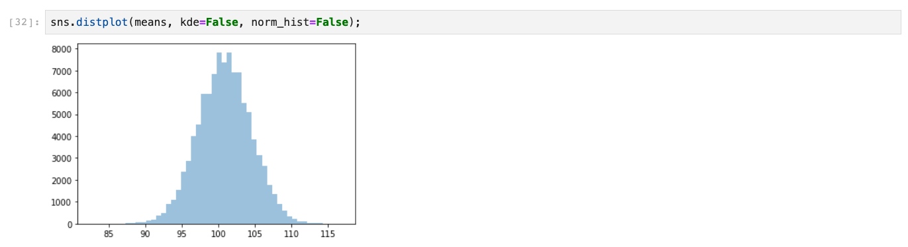

Como puedes ver, es bastante normal en forma. Veamos la distribución de nuestra mediana:

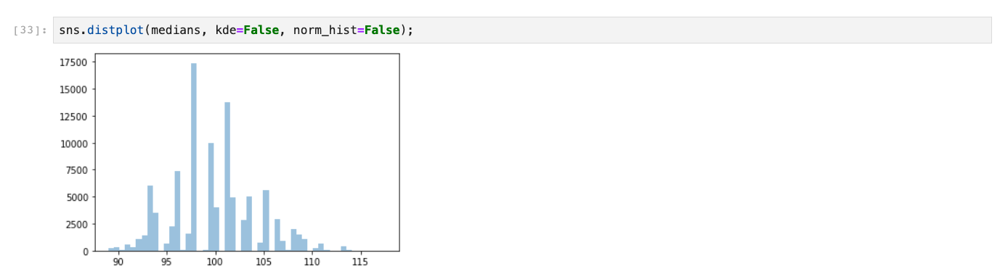

En este caso, la forma de nuestra distribución es mucho menos clara. Pareciera que hay un pequeño sesgo hacia la izquierda, lo cual podría significar que nuestra muestra original está un poco sesgada (decimos "podría" porque habría que realizar más exploración para estar seguros). Pero en realidad los picos en esta distribución están básicamente en el mismo lugar que nuestro primer histograma, así que podría ser solamente un efecto de nuestro remuestreo.

##### Error estándar

El error estándar es una medida de la variabilidad de la estadística que estamos analizando. Nos sirve para saber cuánta incertidumbre existe alrededor de nuestro valor estadístico. Recordarás que la desviación estándar es una de las medidas de variabilidad que utilizamos para saber cuánta variación existe en un conjunto de datos. El error estándar es la desviación estándar de la medida estadística que cuantificamos a nuestras `R` muestras durante el bootstrap.

Una vez que construimos `R` muestras y calculamos la estadística de interés para cada una de esas muestras (el promedio, la mediana, etc.), entonces podemos sacar la desviación estándar del conjunto de estadísticas resultantes para saber su variabilidad. Obviamente el error estándar se va a ver reflejado en nuestro histograma, ya que la medida de curtosis está directamente relacionada con la desviación estándar.

Podemos interpretar nuestros resultados así:

- Entre mayor el error estándar (y por lo tanto mayor curtosis), más variabilidad e incertidumbre en nuestra medida estadística.
- Entre menor el error estándar (y por lo tanto menor curtosis), menor variabilidad e incertidumbre en nuestra medida estadística.

El error estándar de la media y la mediana de nuestro ejemplo son los siguientes:

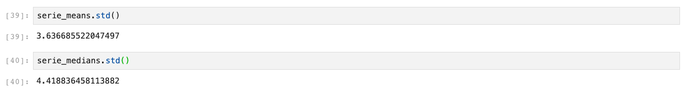

Dado el valor obtenido en el cálculo de la media y mediana de la muestra original, podemos observar que hay poca varabilidad en nuestros datos.

###### Intervalo de confianza

Podemos obtener un intervalo de confianza de nuestra medida estadística que resuma el nivel de confianza que tenemos en ella. Esto se hace a partir de nuestro histograma. Si recuerdas en un histograma nuestros valores están organizados de menores a mayores. Por lo tanto, si quisiéramos obtener el "rango donde se encuentran el 95% de mis valores", lo único que tendríamos que hacer es recortar el 2.5% de nuestros valores al inicio de nuestro histograma y otros 2.5% al final.

Con este intervalo que estaríamos diciendo es "tenemos un 95% de seguridad de que si tomamos una muestra de nuestra población original y obtenemos la medida estadística que buscamos, dicha medida va a caer dentro de este rango, con tendencia hacia la mitad del rango".

Podemos obtener nuestros intervalos de confianza utilizando cuantiles. Estos son los intervalos de confianza en nuestro ejemplo:

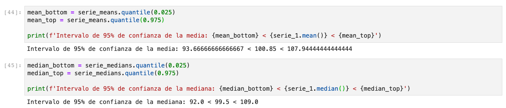

### Técnicas de evaluación de modelos

Así como podemos tener incertidumbre en nuestras medidas estadísticas, también podemos tener incertidumbre en los modelos que entrenamos (por ejemplo, un modelo de Regresión Lineal Simple). Tener incertidumbre acerca de un modelo básicamente se resume como "no estar seguros si nuestro modelo tiene la misma efectividad en el mundo real que la que tiene usando nuestro dataset de entrenamiento".

Cuando entrenamos un modelo, normalmente este modelo lo vamos a entrenar utilizando una muestra de la población total. Esto significa que si queremos utilizar nuestro modelo para realizar predicciones, podemos toparnos con el problema de que nuestro modelo funcione muy bien para predecir los datos que tenemos a la mano, pero que funcione pésimamente cuando intentamos hacer predicciones con datos que no conoce.

Para tener un poco más de confianza en que los resultados obtenidos con nuestro dataset de entrenamiento se generalizan a datos en el mundo real, podemos utilizar las siguientes dos técnicas:

#### Datasets de Entrenamiento y Prueba

Algo que podemos hacer es dividir nuestro dataset en dos. Ya que casi nunca es posible regresar a la fuente a conseguir más datos (con el fin de obtener un dataset de pruebas), podemos simplemente aprovechar el que tenemos.

Este procedimiento funciona de esta manera:

1. Toma tu dataset y revuélvelo de manera aleatoria. Esto es importante para (una vez más) intentar evitar los sesgos en tus datos.
2. Elige el porcentaje de tus datos que van a servir como prueba. Es común utilizar el 30% de tus datos para prueba y el 70% para entrenamiento.
3. Divide tu dataset revuelto en los porcentajes definidos en el paso 2.
4. Entrena tu modelo utilizando el dataset de entrenamiento.
5. Con tu modelo entrenado, realiza predicciones utilizando el dataset de prueba.
6. Usando las predicciones y los valores esperados de tu dataset de prueba, evalúa la precisión de tu modelo.

Haciendo las cosas de esta manera, tenemos un poco más de confianza en que nuestro modelo tendrá un desempeño similar en el mundo real que el que tuvo durante su entrenamiento.

Si el modelo tiene un puntaje muy bueno durante el entrenamiento pero uno pésimo durante la prueba, quiere decir que aprendió muy bien a predecir los datos que conoce pero que no es capaz de generalizar a datos desconocidos.

#### Validación cruzada

Aún utilizando la división entre dataset de entrenamiento y prueba podemos toparnos con la incómoda situación en la que por pura casualidad dividimos nuestro dataset de forma que nuestro modelo parezca que generaliza cuando no es cierto. ¿Qué tal si otra división de nuestro dataset resulta en un peor (o mejor) desempeño? Para resguardarnos de esta posibilidad, podemos utilizar validación cruzada. Hay varios algoritmos de validación cruzada, pero hoy sólo vamos a aprender uno que se llama validación cruzada de K-iteraciones (o k-fold cross validation). El algoritmo es el siguiente:

1. Tenemos un dataset (cada bolita es un elemento en nuestro conjunto de datos) que ha sido revuelto aleatoriamente:

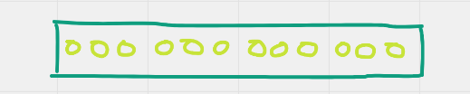

2. Decidimos un número `K` que va a ser el número de subdivisiones en el que vamos a dividir a nuestro dataset. En este caso vamos a dividir nuestro dataset en 4 secciones:

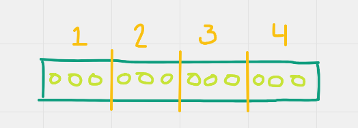

3. Para el primer entrenamiento, dejamos fuera la primera sección. Entrenamos usando la secciones restantes, probamos el modelo entrenado con la primera sección y evaluamos su desempeño:

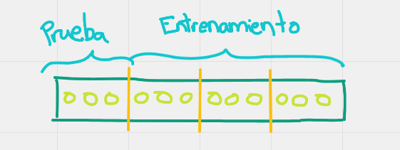

4. Volvemos a entrenar nuestro modelo, pero esta vez dejando fuera la segunda sección como dataset prueba. Entrenamos, probamos con la segunda sección y evaluamos el desempeño del modelo:

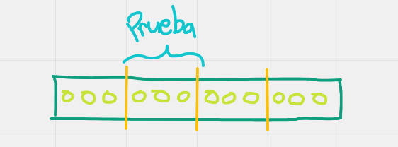

5. Repetimos el proceso `K` veces. En cada iteración dejamos la sección siguiente como dataset de prueba.

6. Tomamos todas las evaluaciones de los `K` entrenamientos (que en el caso de una Regresión Lineal Simple podrían ser coeficientes de determinación) y sacamos el promedio y la desviación estándar. Esto servirá como una medida del "valor típico" de desempeño y la incertidumbre que tiene nuestro modelo.

Después de este proceso tenemos una medida del desempeño de nuestro modelo que resulta mucho más confiable. Con esta información a la mano podemos decidir entonces si vale la pena modificar nuestro modelo para intentar incrementar este desempeño.

---

El día de hoy has aprendido varias técnicas que sirven para lidiar con los sesgos y la incertidumbre en nuestros datos. Recuerda siempre asumir que existen sesgos e incertidumbre en tus datos antes de siquiera empezar a analizarlos. ¡Mucha suerte y nos vemos en el Work!

---

**Quiz**

1. ¿Qué es una *población* en análisis estadístico?

* Es el grupo al cual tenemos acceso a la hora de realizar un experimento
* Es el subconjunto de datos que hemos recibido para realizar nuestros análisis
* **Es el grupo completo acerca del cual se pretende obtener cierta información**
* Es la cantidad de gente que vive en una región geográfica
* Un conjunto de muestras

2. ¿Cómo podemos obtener una muestra que no esté sesgada (o que esté sesgada lo menos posible)?

* Tomando elementos de una población donde no existan los sesgos
* **Tomando elementos de nuestra población de manera aleatoria**
* Dividiendo nuestra población en partes iguales y tomando una de las partes como muestra
* Tomando muestras una y otra vez hasta que obtengamos una que no esté sesgada
* Seleccionando cuidadosamente los elementos que tomamos para la muestra

3. ¿Qué es el error estándar?

* **Es una medida de la variabilidad de la estadística que estamos analizando**
* Es el error esperado a la hora de realizar un Boostrap
* Es el error típico en las medidas de variabilidad estadística
* Es la diferencia entre el tamaño de una población y el tamaño de una muestra
* Es la diferencia entre cada elemento del dataset y el promedio

4. ¿Cómo podemos interpretar el valor del error estándar?

* Entre mayor el error estándar (y por lo tanto mayor curtosis), menos variabilidad e incertidumbre en nuestra medida estadística
* Entre mayor el error estándar (y por lo tanto menor curtosis), menos variabilidad e incertidumbre en nuestra medida estadística
* Entre menor el error estándar (y por lo tanto menor curtosis), más variabilidad e incertidumbre en nuestra medida estadística
* **Entre mayor el error estándar (y por lo tanto mayor curtosis), más variabilidad e incertidumbre en nuestra medida estadística**
* Entre menor el error estándar (y por lo tanto mayor curtosis), más variabilidad e incertidumbre en nuestra medida estadística

5. A la hora de entrenar un modelo de Regresión Lineal, ¿de qué nos sirve dividir nuestro dataset en entrenamiento y prueba?

* Es parte del proceso organizado de un científico de datos
* Nos ayuda a disminuir el error estándar
* **Nos permite tener cierta seguridad de que nuestro modelo tenga el mismo desempeño en el mundo real**
* El modelo de Regresión Lineal sólo puede ser entrenado con el dataset de entrenamiento
* Facilita la obtención de una hipótesis válida