
<strong>Curso Data Analysis - Módulo 4 PREWORK de Visualización de Datos Avanzada</strong>

<strong>PREWORK SESIÓN 6</strong>

### Introducción

Esta sesión es sobre visualización de datos. Vamos a aprender muchos tipos de gráficas que nos dan perspectivas distintas sobre nuestros datos. Algunas de estas gráficas no son tan comunes como las que ya hemos aprendido, pero resultan ser muy útiles para algunas situaciones específicas.

También aprenderemos cómo manipular los estilos de nuestros gráficas, para poder adaptarlas a cualquier situación que lo requiera.

#### Objetivos

- Aprender a modificar los estilos predeterminados de nuestras gráficas

Conocer y aprender a interpretar las siguientes gráficas:

- Treemaps
- Scatterplots por categorías
- Scatterplots con variables condicionantes
- Binnings Hexagonales
- Mapas cloropléticos
- Gráficas de barras apiladas

---

### Estilos

Tanto `seaborn` como `matplotlib` traen varios estilos prehechos que podemos aplicar a nuestras gráficas para cambiar su apariencia. Veamos algunas posibilidades. Éste es nuestro estilo default:

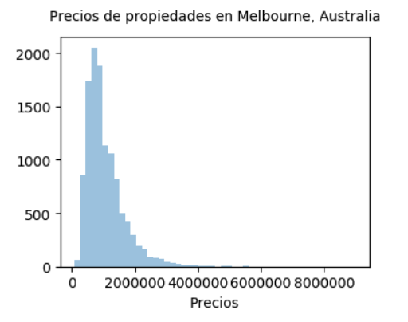

Con tan solo una línea de código podemos hacer que nuestra gráfica tenga un estilo diferente. Por ejemplo, éste es el estilo 'white' de `seaborn`:

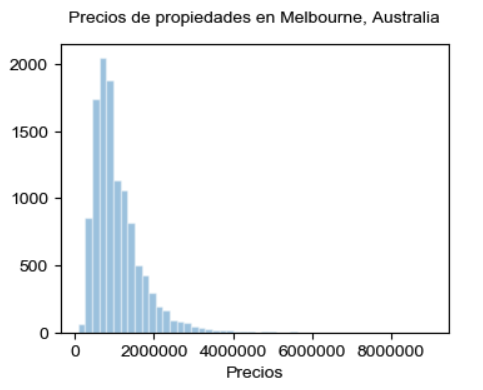

O éste es el 'darkgrid', también de `seaborn`:

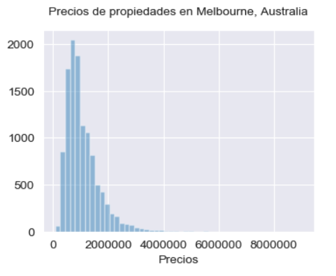

Éste otro es el estilo 'bmh' de `matplotlib`:

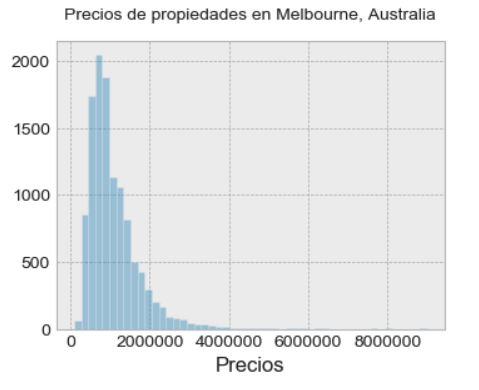

`matplotlib` también tiene algunos estilos que imitan los estilos de otras librerías, como `ggplot`:

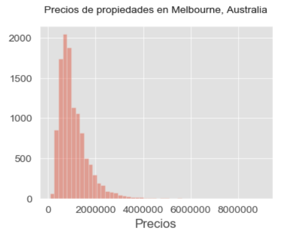

O incluso uno que imita al conocido blog [Five thiry eight](https://fivethirtyeight.com/):

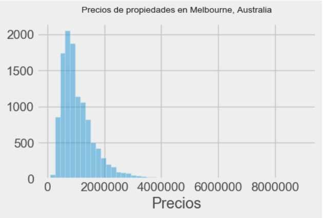

Hay muchos otros disponibles. Cada uno podría ser útil para un contexto en específico, ¡así que vale la pena explorarlos y conocerlos!

Puedes encontrar listas completas de estilos [aquí para Seaborn](https://seaborn.pydata.org/tutorial/aesthetics.html) y [aquí para Matpotlib](https://matplotlib.org/3.2.1/gallery/style_sheets/style_sheets_reference.html).

---

¡Veamos ahora varios ejemplos de tipos de visualizaciones que pueden serte útiles a la hora de mostrar tus análisis al mundo!

---

### Treemaps

Los treemaps son graficas que sirven para visualizar datos jerárquicos usando figuras (normalmente rectángulos) anidadas. ¿Qué son datos jerárquicos? Son datos que están organizados en varios niveles. Por ejemplo, he aquí una organización jerárquica de 3 niveles:

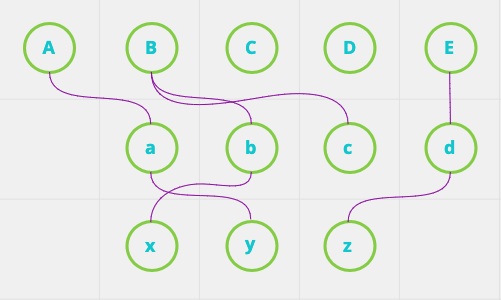

En esta organización jerárquica tenemos círculo que actúan como 'madres', otros como 'hijas' y algunos como ambos.

El nivel superior es el primer nivel. Los círculos en este nivel no tienen 'madres' (jeje). Pero todos ellos funcionan como 'madres' de algunos círculos del segundo nivel. Cada 'madre' puede tener más de una 'hija'.

En el segundo nivel, los círculos pueden tener una o ninguna 'madre' del nivel superior, y pueden ser 'madres' de 'hijas' en el nivel inferior.

En el tercer nivel, todos los círculos tienen una o ninguna 'madre' del segundo nivel, y no tienen ninguna 'hija'.

Si pensamos en cada nivel como una columna categórica en un `DataFrame`, podemos construir un `treemap` de esta jerarquía y obtendríamos lo siguiente:

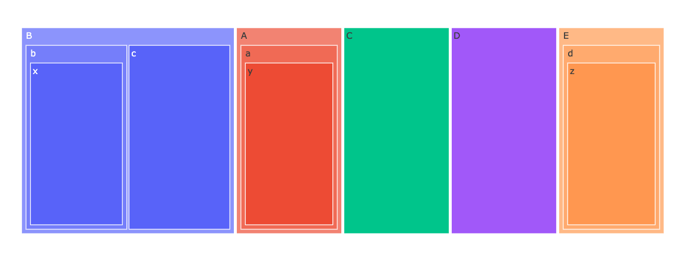

¡Ése es nuestro primer treemap! Este treemap solamente está siendo utilizado para describir una organización jerárquica. Pero tenemos también otra posibilidad. Si al final de la jerarquía tenemos una columna con valores numéricos, entonces podemos modificar el tamaño de los rectángulos del último nivel para que sean de un tamaño proporcional al valor numérico. Por ejemplo, en nuestro dataset 'athlete_olympic_events-clean.csv' podemos visualizar la proporción de hombres y mujeres en cada uno de los deportes que se llevan a cabo en las Olimpiadas:

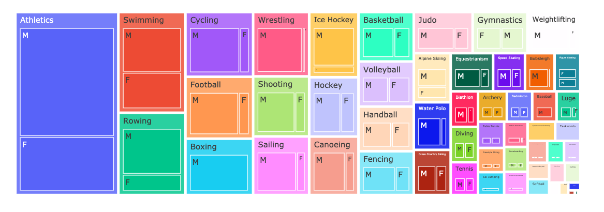

En este treemap, cada 'madre' es un deporte y el rectángulo que el corresponde es proporcional al número de deportistas que participan en ese deporte. Luego cada 'madre' tiene dos 'hijas', cada una representando la proporción de hombres y mujeres que juegan ese deporte. Visualizando los datos de esta manera podemos, por ejemplo, observar muy rápidamente que en prácticamente **todos** los deportes hay más hombres que mujeres participando. Eso no es nada justo, ¿no lo crees?

### Scatterplots por categorías

Los scatterplots o gráficas de dispersión ya son viejos amigos nuestros. Hay una variación de estas gráficas que nos puede resultar sumamente útil cuando estamos haciendo análisis multivariable. Para hacer un scatterplot por categorías necesitas tener dos variables numéricas (que servirán como tus ejes `x` y `y`) y una variable categórica. Las variables numéricas las graficamos como siempre lo hemos hecho. Por ejemplo, aquí estamos visualizando la relación entre pesos y alturas de algunos de los atletas olímpicos incluidos en 'athlete_olympic_events-clean.csv':

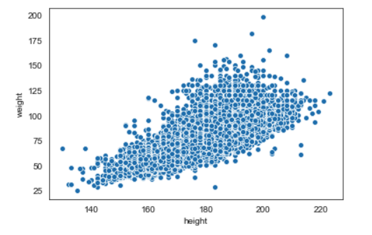

Ahora, podemos colorear los puntos utilizando la variable categórica 'sex':

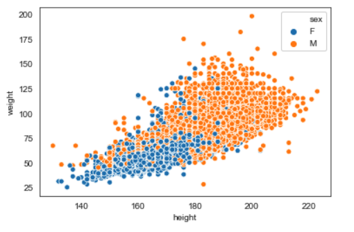

Interesante, ¿no lo crees? Colorear nuestros puntos de esta manera nos da acceso a mucha más información. Ahora podemos no solamente visualizar la relación que hay entre las variables de peso y de altura, sino también comparar a hombres y mujeres y las diferencias de peso y altura que tienen.

Podemos tener más de dos categorías. Por ejemplo, en esta gráfica vamos a visualizar la relación de altura y peso de los atletas que juegan algunos de los deportes que incluyen un balón:

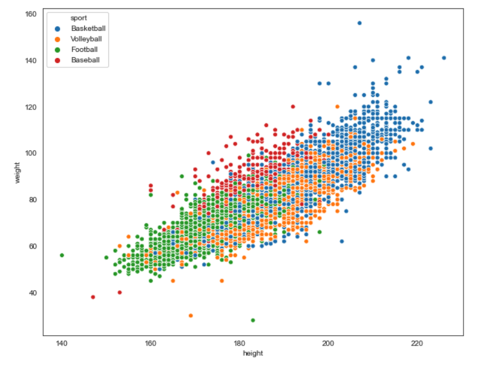

¿Qué piensas de esta gráfica? ¿Qué patrones interesantes emergen?

### Scatterplots con variables condicionantes

Hay veces que un scatterplot por categorías puede no resultar suficientemente claro. En estos casos vale la pena realizar scatterplots con variable/s condicionante/s. La variable (o variables) condicionante es la variable categórica que quieres comparar. Para hacer este tipo de gráfica primero tenemos que separar nuestro dataset en dos o más partes, una parte por cada valor posible de la variable categórica. Después realizamos múltiples scatterplots, uno por cada valor de la variable categórica, los colocamos en distintas gráficas y las comparamos. Por ejemplo, he aquí la última gráfica que hicimos en la sección anterior, pero como scatterplots con variable condicionante:

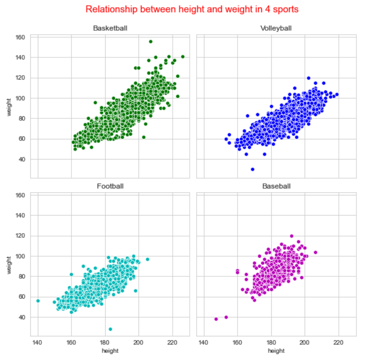

Como puedes ver, hay algunos detalles que eran difíciles de observar en la gráfica pasada. Ambas tienen sus ventajas y desventajas, pero como siempre: más perspectivas de los mismos datos te ofrecen más información.

### Binning Hexagonal

En alguno de los Retos que has realizado, ya te has topado con los Binnings Hexagonales. Los binnings hexagonales son herramientas muy útiles para cuando queremos visualizar la relación entre dos variables numéricas en un dataset que contienen un gran número de filas. Tomemos de nuevo nuestro dataset 'athlete_olympic_events-clean.csv'. La primera gráfica scatterplot que realizamos para visualizar la relación entre la variable de altura y la de peso sólo tomó en cuenta un tercio del total de las filas del dataset. Aún así, la gráfica resulta algo atascada. Este dataset tiene alrededor de 100 000 filas, y por lo tanto es difícil realmente saber qué tanta densidad hay cuando visualizamos esta relación usando un simple scatterplot:

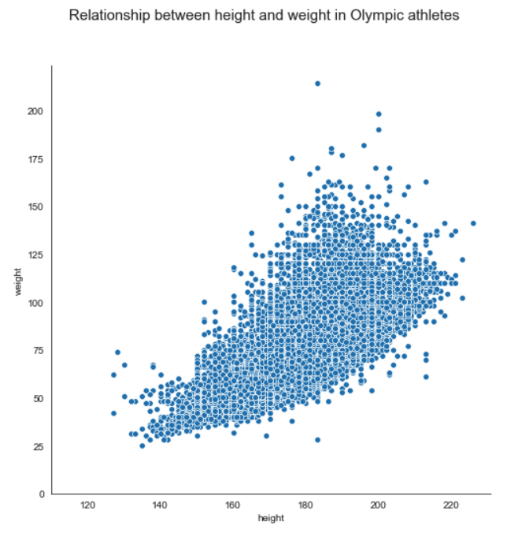

Un binning hexagonal hace lo siguiente:

1. Divide el plano cartesiano en un número determinado de hexágonos.
2. Coloca los puntos del scatterplot sobre el plano.
3. Cuenta cuántos puntos caen en cada hexágono y le asigna ese conteo a cada hexágono.
4. Le asigna a cada hexágono un color dentro de un espectro. Entre más obscuro sea el color, más puntos había sobre de ese hexágono. Entre más claro el color, menos puntos había sobre ese hexágono.

De esta manera resulta mucho más fácil visualizar la densidad de los puntos sobre el plano, ya que el espectro se asigna de manera proporcional. Estos son los mismos datos graficados en un binning hexagonal. Observa que `seaborn` coloca además un histograma para cada variable, para hacer muy evidente también cómo participa cada variable para generar la densidad de puntos en la gráfica:

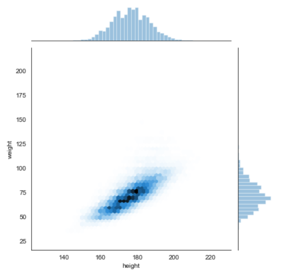

### Mapas Cloropléticos

Cuando estamos trabajando con datos geográficos, muchas veces es necesario agregar mapas que ayuden a visualizar datos estadísticos. Una de las visualizaciones más comunes son los mapas cloropléticos (choropleth maps). Los mapas cloropléticos se parecen de alguna manera a los mapas de calor. Primero dividimos nuestro mapa en regiones (lo más común es dividir por estados o por países ). Luego coloreamos cada región de acuerdo a un espectro de color que representa la segmentación de una variable estadística.

Por ejemplo, en este mapa (tomado de la [documentación de la librería Folium](https://python-visualization.github.io/folium/quickstart.html#Getting-Started)) estamos visualizando la tasa de desempleo en Estados Unidos durante Octubre del 2012:

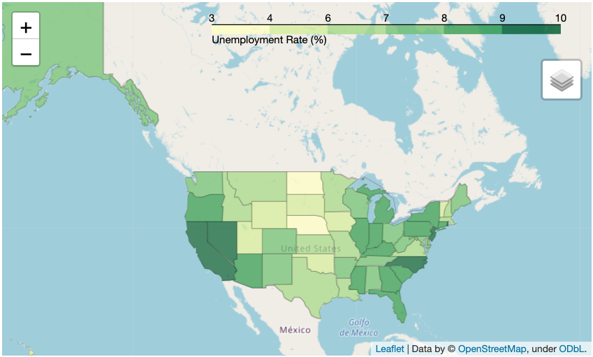

Observa la leyenda arriba a la derecha que indica la escala que se está manejando y el color que se le ha asignado a cada valor.

### Gráficas de barras apiladas

En la misma vena que los scatterplots por categorías tenemos a las gráficas de barras apiladas. Una gráfica de barras apilada se utiliza para graficar un valor numérico segmentado a partir de dos variables categóricas. La primera categoría es la que se utiliza para definir los valores del eje `x`. La segunda categoría se utiliza para dividir las barras en segmentos.

Por ejemplo, regresemos una vez más a nuestro dataset de atletas Olímpicos. Voy a filtrar mis datos para sólo tener los mismos 4 deportes que ya exploremos anteriormente. Si yo realizo gráfica de barras para visualizar los conteos de frecuencia de cada uno de estos deportes, obtengo lo siguiente:

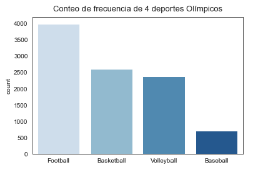

Ahora, una opción para visualizar también la división por género sería realizar dos gráficas distintas, una para cada género. Aunque esto es deseable en algunas ocasiones, si queremos visualizar también cómo es que cada género participa como segmento del todo, una gráfica de barras apiladas sería una mejor opción. Esto se vería así:

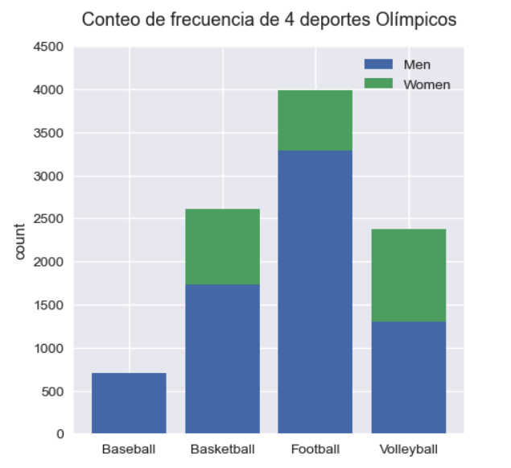

Una vez más, en esta gráfica queda muy clara la disparidad que existe en la participación de hombres y mujeres en los deportes Olímpicos. A excepción del volleyball, donde la proporción es casi igual, en los demás deportes la participación de mujeres es muy pequeña o hasta nula (en el caso del baseball). Ésta es una prueba de las inequidades, injusticas y sesgos que podemos revelar cuando estudiamos datos. Recuerda siempre la gran responsabilidad que tenemos como científicos de datos de no solamente encontrar estos problemas, sino de comunicarlos y participar activamente en su resolución.

---