
<strong>Curso Data Analysis - Módulo 4 PREWORK de Introducción a Machine Learning: Clasificación No Supervisada y Supervisada</strong>

<strong>PREWORK SESIÓN 8</strong>

### Introducción

Ésta es nuestra última sesión. Antes que nada quisiera felicitarte por haber llegado hasta aquí. Se requiere mucha disciplina y entrega terminar algo. Te aseguro que todo lo que has aprendido en este módulo te será de muchísima utilidad en tu camino como científico de datos profesional.

En este Prework vamos a ver una pequeña introducción al campo del Machine Learning. Vamos a aprender qué significa Machine Learning, en qué se utiliza y por qué nos es tan útil. Para practicar el concepto, haremos algunos ejercicios de clasificación no supervisada y supervisada utilizando la librería `scikit-learn`.

#### Objetivos

- Identificar la definición de Machine Learning, qué es y cómo se utiliza
- Identificar cuándo es buena idea aplicar un algoritmo de K-Medias
- Interpretar los resultados de K-Medias
- Identificar cuándo es buena idea aplicar un algoritmo de Regresión Logística
- Evaluar un modelo de Regresión Logística utilizando matriz de confusión y curva ROC / AUC

---

### ¿Qué es Machine Learning?

Machine Learning es el estudio de algoritmos por computadora que mejoran automáticamente a través del entrenamiento y la experiencia. Se llama Machine **Learning** justamente por que este proceso de mejora y actualización a través de la experiencia es lo que hacemos nosotros los humanos cuando aprendemos. Los algoritmos de Machine Learning construyen modelos matemáticos a partir de conjuntos de datos con los que se entrenan, para poder realizar predicciones o decisiones basándose en los patrones que hayan encontrado. Un humano no programa explícitamente el comportamiento de un algoritmo de Machine Learning, sólo decide sus parámetros de entrenamiento y elige el conjunto de datos con el que se le va a entrenar.

Machine Learning es un subconjunto de algoritmos de lo que solemos llamar Inteligencia Artificial.

¿Por qué nos interesa a nosotros como científicos de datos? Explicar y entender un fenómeno es muy interesante, pero en realidad la razón principal por la que queremos estudiar un fenómeno es para poder tomar mejores decisiones en el futuro. La ciencia de datos nos ayuda a comprender más detalladamente el mundo para poder actuar de manera más efectiva y eficiente.

Hay muchas veces donde nos bastan las herramientas que hemos aprendido hasta ahora. Pero hay algunos fenómenos y problemas que resultan demasiado complejos como para que nosotros podamos simplemente comprenderlos. Aquí es donde entra el Machine Learning. Los algoritmos de Machine Learning aprovechan las cosas en las que las computadoras son mejores que los humanos para hallar patrones inospechados en nuestros datos y ayudarnos a tomar decisiones.

Algunas de las cosas que podemos hacer con Machine Learning son:

1. Predicción: predecir qué va a suceder en el futuro o predecir cómo se va a comportar una variable si modificamos otras variables.
2. Clasificación: clasificar una muestra univariada o multivariable dependiendo de sus características.
3. Generación: aprender patrones de nuestros datos para poder generar nuevos datos que sean similares a los originales.
4. Aprendizaje no Supervisado: aprender a realizar acciones o tomar decisiones a partir de la vivencia de una situación específica.

Hay muchas otras cosas que se pueden hacer, y en realidad estos 4 tipos de Machine Learning también se pueden subdividir muchísimo, pero con tan solo estas cortas descripciones seguramente te habrás dado cuenta ya de que el potencial es muy grande.

En realidad ya hemos usado un algoritmo de Machine Learning en sesiones pasadas: la Regresión Lineal. La Regresión Lineal es uno de los algoritmos más sencillos de Machine Learning, pero cumple con las características que acabamos de mencionar: es un algoritmo que utiliza conjuntos de datos para desarrollar un modelo matemático (la ecuación que utilizamos para construir una línea recta) que nos permite hacer predicciones (con distintos grados de precisión). La Regresión Lineal entonces pertenece al grupo 1 de nuestro listado anterior.

Hoy vamos a explorar otro tipo distinto de algoritmos que sirven para *clasificar* datos. Machine Learning es un tema muy extenso y algo complejo, por lo que en este módulo sólo pretendemos dar una muy ligera introducción al tema. Esperamos que esta introducción sea suficiente para motivar tu curiosidad y para que tengas las herramientas para profundizar en el tema si así lo deseas.

### Clasificación usando Machine Learning

Los humanos estamos clasificando objetos y seres vivos todo el tiempo. Cada vez que vemos algo en el mundo, nuestro cerebro inmediatamente intenta recordar un patrón similar que hayamos visto antes para poder reconocer lo que estamos viendo. Las computadoras no pueden hacer eso naturalmente. Pero hay algunos algoritmos de Machine Learning que han sido construidos para darle a las computadoras esta capacidad. Vamos a aprender dos de ellos: Agrupamiento por K-Medias y Regresión Logística.

#### Agrupamiento por K-Medias (Clasificación No Supervisada)

El agrupamiento por K-Medias pertenece a la categoría de algoritmos de clasificación no supervisada. Resulta muy útil cuando tenemos un dataset que queremos dividir por grupos pero no sabemos exactamente qué grupos queremos y cuáles son sus características. Lo único que tenemos que decidir de antemano es *cuántos* grupos queremos, y el algoritmo intentará agrupar nuestros datos en esa cantidad de grupos. Veamos un ejemplo.

Mira esta gráfica que fue realizada con datos de las ubicaciones de actividades criminales en el mes de Octubre 2014 en alguna región no especificada:

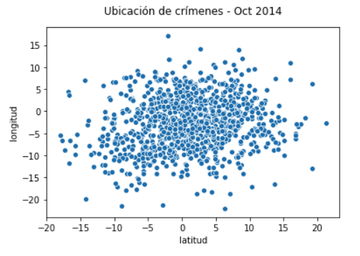

Queremos dividir nuestra región geográfica en múltiples subregiones para desplegar nuestros recursos de vigilancia limitados de manera que toda la región sea vigilada con igual magnitud. Para eso no basta con tomar nuestra región y dividirla en secciones de igual tamaño. Como podemos ver en nuestra gráfica, la densidad de las actividades criminales cambia a través del espacio geográfico, y por lo tanto tenemos que dividir la región tomando en cuenta estas diferencias en densidad.

Éste es un caso perfecto para utilizar agrupamiento por K-Medias: no estamos seguros de cómo subdividir nuestra region ni cuáles son las características de las subregiones. Sólo sabemos que tenemos recursos suficientes para establecer 6 centros de vigilancia.

El algoritmo de K-Medias recibe un conjunto de datos multivariable como dataset de entrenamiento y localiza un número especificado de 'centroides' alrededor de los cuales se agrupan nuestros datos. Los datos alrededor de cada centroide estarán lo más cerca posible de su centroide y de los datos que comparten el mismo centroide, y estarán lo más lejos posible de los demás centroides y de los datos que pertenecen a esos otros centroides.

Tomemos el ejemplo que acabamos de visualizar y apliquemos el algoritmo de K-Medias para encontrar 6 centroides:

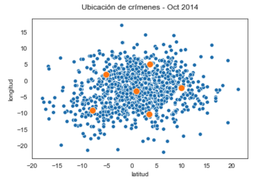

Cada uno de nuestros puntos pertenece a uno de los 6 grupos que acabamos de crear. Podemos visualizar su pertenencia de esta manera:

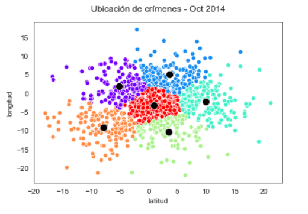

K-Medias encontró 6 centroides donde cada uno de los puntos que pertenecen a ese centroide se encuentra lo más cercano posible al centroide del grupo al que pertenece, y lo más lejano posible de los demás centroides. Ahora podríamos colocar un centro de vigilancia en cada uno de esos centroides y saber que cada región está debidamente vigilada. Obviamente la distribución de las locaciones podría variar, pero si nuestro patrón se mantiene similar a través del tiempo, nuestra solución funcionaría aunque sea por un tiempo.

En caso de que tuviéramos recursos para 8 centros de vigilancia, podemos simplemente pedirle al algoritmo que genere 8 grupos:

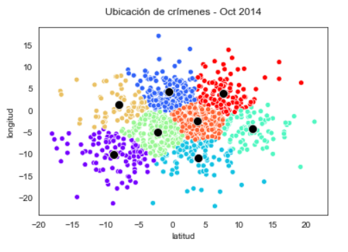

Los datos son los mismos, pero han sido agrupados de manera distinta.

Si quieres saber más acerca del algoritmo K-Medias y sus distintas aplicaciones, puedes leer el siguiente [artículo](https://www.unioviedo.es/compnum/laboratorios_py/kmeans/kmeans.html).

#### Regresión Logística (Clasificación Supervisada)

La regresión logística nos sirve para resolver problemas de clasificación binaria supervisada. ¿Qué significa eso? *Binario* significa que los datos pueden ser clasificados solamente en dos categorías: positivo y negativo (sí y no; 0 y 1). *Supervisado*, a diferencia de la clasificación no supervisada, significa que sabemos exactamente cuáles son las dos categorías en las que queremos agrupar a nuestros datos, y que además tenemos un conjunto de datos de entrenamiento que ha sido clasificado de antemano.

En la clasificación supervisada entonces necesitamos entrenar a nuestro modelo con un conjunto de datos que ha sido *etiquetado* de antemano. En nuestro conjunto de datos de entrenamiento necesitamos una variable dependiente binaria que sea la clasificación que queremos que nuestro modelo aprenda a realizar.

¿Por qué se llama Regresión al igual que la Regresión Lineal? Bueno, porque el método de entrenamiento es muy similar al de la regresión lineal. De hecho, la Regresión Logística también busca la ecuación de una línea, pero luego pasa el resultado por otro tipo de función que nos da un resultado probabilístico. La probabilidad se encuentra en un intervalo de 0 a 1. Para decidir cuál de las dos clasificaciones regresar como resultado, definimos un *umbral* entre 0 y 1. Por ejemplo, podemos definir un umbral de 0.4. Entonces, cada vez que obtenemos una probabilidad menor a 0.4, regresamos la clasificación negativa (no; 0); de igual manera, cada vez que obtenemos un valor mayor a 0.4, regresamos una clasificación positiva (sí; 1).

Veamos un ejemplo para que esto quede más claro.

Tenemos un dataset recabado en un hospital de Wisconsin, que puedes encontrar en [este link](https://www.kaggle.com/uciml/breast-cancer-wisconsin-data). En este dataset tenemos algunas mediciones que se hicieron en tumores de mama, y tenemos una columna de diagnóstico donde se indica si el tumor fue diagnosticado como benigno o maligno:

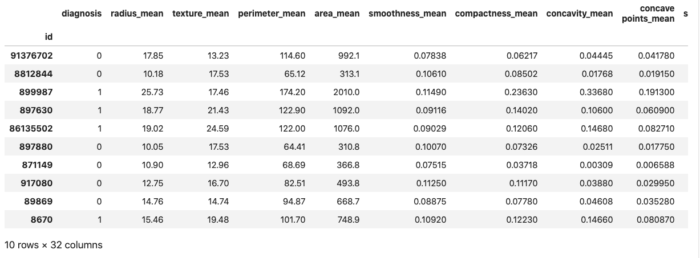

Todas las variables independientes son numéricas y la variable dependiente ('diagnosis') es binaria.

Vamos a utilizar la clase `LogisticRegression` de `scikit-learn` para entrenar un modelo de regresión logística. Primero, como ya aprendiste en una sesión anterior, separamos nuestro dataset en dataset de entrenamiento y de prueba. Después, entrenamos el modelo utilizando nuestros datos de entrenamiento. Aprenderás cómo entrenar este modelo durante el Work, pero por el momento solamente vamos a concentrarnos en los métodos que tenemos a la mano para evaluar a nuestro modelo entrenado. Ya que hemos entrenado nuestro modelo y ya que el modelo puede clasificar las entradas del dataset de prueba, ¿cómo sabemos qué tan bueno es este modelo?

#### Matriz de confusión

Para evaluar un modelo de clasificación binaria podemos utilizar algo llamado matriz de confusión. Una matriz de confusión se ve algo así:

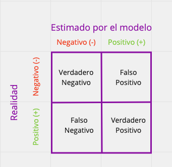

Es una matriz de 2x2 donde el eje x son los resultados estimados por el modelo entrenado y el eje y es la realidad (las etiquetas originales en nuestro dataset de prueba). Dependiendo de cuál era la etiqueta real y cuál fue la que nuestro modelo estimó, hay 4 posibles categorías:

1. Verdadero Positivo (VP): Cuando la etiqueta real era positiva y nuestro modelo regresó un resultado positivo.
2. Falso Negativo (FN): Cuando la etiqueta real era positiva pero nuestro modelo regresó un resultado negativo.
3. Falso Positivo (FP): Cuando la etiqueta real era negativa pero nuestro modelo regresó un resultado positivo.
4. Verdadero Negativo (VN): Cuando la etiqueta real era negativa y nuestro modelo regresó un resultado negativo.

En estas 4 categorías se engloban todas las posibilidades. Obviamente queremos que la cantidad de Verdaderos Positivos y Verdaderos Negativos sea lo mayor posible. He aquí la matriz de confusión obtenida de clasificar nuestro dataset de prueba con el modelo que entrenamos:

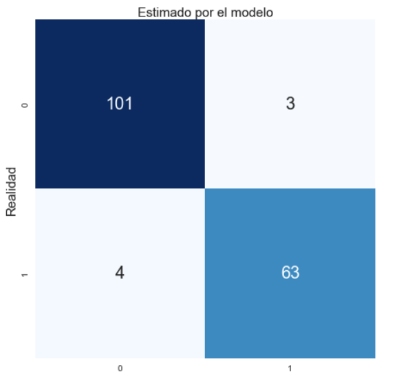

Ok, tenemos esos números. ¿Pero cómo obtenemos medidas precisas de qué tan bueno es nuestro modelo? Con la Regresión Lineal teníamos nuestro R2, en Regresión Logística tenemos 4 medidas llamadas: Precisión (Precision), Exactitud (Accuracy), Sensibilidad (Recall / Sensitivity) y Especificidad (Specificity). Los siguientes son sus significados y cómo obtener cada uno:

1. Precisión: De todas las clasificaciones positivas que hicimos, ¿cuántas de ésas eran en realidad positivas?

`precision = VP / (VP + FP)`

2. Exactitud: Del total de clasificaciones que hicimos, ¿cuántas fueron clasificadas correctamente?

`exactitud = (VP + VN) / (VP + FN + FP + VN)`

3. Sensibilidad: De todas las clasificaciones positivas que había en realidad, ¿cuántas fueron clasificadas correctamente como positivas?

`sensibilidad = VP / (VP + FN)`

4. Especificidad: De todas las clasificaciones negativas que había en realidad, ¿cuántas fueron clasificadas correctamente como negativas?

`especificidad = VN / (VN + FP)`

Todas estas medidas pueden tener valores entre 0 y 1. Entre más cerca del 1 estén, mejor es nuestro modelo. En nuestro ejemplo, éstas son las medidas que obtuvimos:

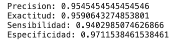

Como puedes ver, ¡este modelo es bastante bueno! Esto significa que podría ser utilizado de manera exitosa para diagnosticar si un tumor de mama es maligno o benigno.

Hay una manera también de utilizar la sensibilidad y la especificidad para graficar nuestros resultados. Veamos cómo funciona esto.

#### Curva ROC / AUC

La curva ROC / AUC es un método de evaluación de modelos de clasificación utilizando diferentes *umbrales*. Una gráfica de curva ROC / AUC se ve así:

Ok, ¿cómo interpretamos esta gráfica?

Como puedes ver, el eje `y` representa la proporción de Verdaderos Positivos, que es lo mismo que la Sensibilidad. Entonces el eje `y` representa la proporción de Verdaderos Positivos contra el total de clasificaciones positivas que había en realidad.

El eje `x` está representando la proporción de Falsos Positivos. Esto quiere decir: de todas las clasificaciones negativas que había en realidad, cuántas fueron clasificadas como positivas por nuestro modelo. Para obtener este valor, simplemente réstale el valor de Especificidad a 1 (`1 - especificidad`).

La curva ROC, la que ha sido coloreada en el dibujo con un color amarillo canario, está graficando entonces el cambio en la proporción de Verdaderos Positivos contra la proporción de Falsos Positivos a través de diferentes *umbrales*. Recordarás que el *umbral* es el número que utilizamos para elegir 'a partir de qué probabilidad el resultado se toma como positivo'. En umbrales muy bajos como 0.2, es mucho más probable que un resultado se marque como positivo, pues todos los valores que caigan por encima de 0.2 serán marcados como positivos. En umbrales de 0.8 es mucho más probable que un resultado se marque como negativo, pues todos los valores que caigan por debajo de 0.8 serán marcados como negativos.

La AUC (Area Under The Curve) o área debajo de la curva es, como su nombre bien lo dice, toda el área que se encuentra por debajo de la curva ROC. El valor puede caer en un intervalo entre 0 y 1.

Un valor de AUC cercano a 1, como el que podemos ver en el dibujo anterior, significa que nuestro modelo es muy bueno para diferenciar entre positivos y negativos. Además, es muy probable que elija el valor correcto.

Un valor de AUC cercano al 0.5 significa que nuestro modelo no puede diferenciar entre positivos y negativos. Un valor cercano al 0.5 se vería así:

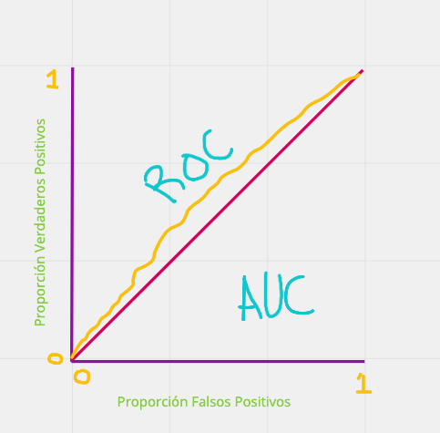

Un valor cercano a 0 significa que nuestro modelo es muy bueno para diferenciar entre positivos y negativos **pero** elige casi siempre el valor contrario al real. O sea, elige positivos cuando debería de elegir negativos, y viceversa. Esta gráfica se vería así:

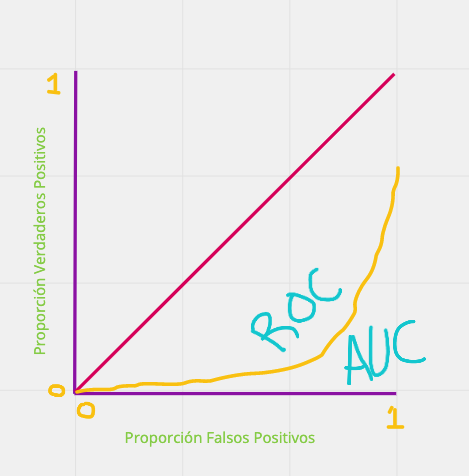

Grafiquemos la curva ROC / AUC del modelo que entrenamos. Es de esperarse que el valor de AUC sea muy cercano a 1, ya que hemos visto que nuestro modelo es bastante efectivo:

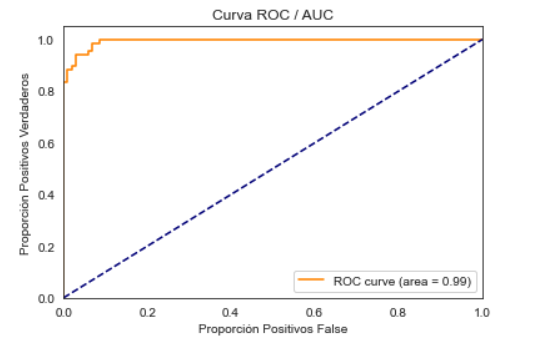

Efectivamente, ¡tenemos un valor de AUC de 0.99!

Utilizando las medidas de Exactitud, Precisión, Sensibilidad y Especificidad, así como la curva ROC / AUC, podemos concluir que nuestro modelo es bastante efectivo para diagnosticar si un tumor de mama es maligno o benigno.

---

**Quiz**

1. ¿Cuál es la diferencia entre Machine Learning e Inteligencia Artificial?

* La Inteligencia Artificial imita la inteligencia humana, Machine Learning imita el aprendizaje humano
* **Machine Learning es un subconjunto de la Inteligencia Artificial**
* Son lo mismo con distintos nombres
* Inteligencia Artificial es un cubconjunto de Machine Learning
* La Inteligencia Artificial se usa para reemplazar la inteligencia humana; Machine Learning se usa para complementarla

2. ¿Cuándo utilizamos algoritmos de Clasificación No Supervisada?

* Cuando no sabemos qué algoritmo de clasificación queremos utilizar
* Cuando nuestro poder de cómputo es muy limitado
* Cuando tenemos un dataset etiquetado y sabemos exactamente en qué clases queremos agrupar nuestros datos
* **Cuando queremos clasificar nuestros datos pero no sabemos exactamente qué clases queremos y cuáles son sus características**
* Cuando no tenemos tiempo de estar revisando que la computadora haga su trabajo

3. ¿A qué llamamos Clasificación Binaria Supervisada?

* Cuando usamos una computadora para clasificar nuestros datos
* Cuando queremos clasificar nuestros datos pero no sabemos exactamente qué clases queremos y cuáles son sus características
* Cuando tenemos dos clases pero no tenemos un dataset etiquetado de antemano
* **Cuando tenemos un dataset etiquetado y queremos clasificar nuestros datos en una de dos clases posibles**
* Cuando dividimos nuestro dataset en entrenamiento y prueba

4. En un matriz de confusión, ¿a qué se le llama un resultado Falso Positivo?

* Cuando la etiqueta real era negativa y nuestro modelo regresó un resultado negativo
* Cuando la etiqueta real era positiva y nuestro modelo regresó un resultado positivo
* Cuando no teníamos etiqueta real y nuestro modelo regresó un resultado positivo
* Cuando la etiqueta real era positiva pero nuestro modelo regresó un resultado negativo
* **Cuando la etiqueta real era negativa pero nuestro modelo regresó un resultado positivo**

5. Al graficar una curva ROC / AUC, ¿qué representan los ejes `x` y `y` respectivamente?

* **El eje `x` representa la proporción de Falsos Positivos; el eje `y` representa la proporción de Verdaderos Positivos**
* El eje `x` representa la proporción de Verdaderos Negativos; el eje `y` representa la proporción de Falsos Negativos
* El eje `x` representa la Sensibilidad; el eje `y` representa la Especificidad
* El eje `x` representa la proporción de Falsos Negativos; el eje `y` representa la proporción de Verdaderos Negativos
* El eje `x` representa la proporción de Verdaderos Positivos; el eje `y` representa la proporción de Falsos Positivos
